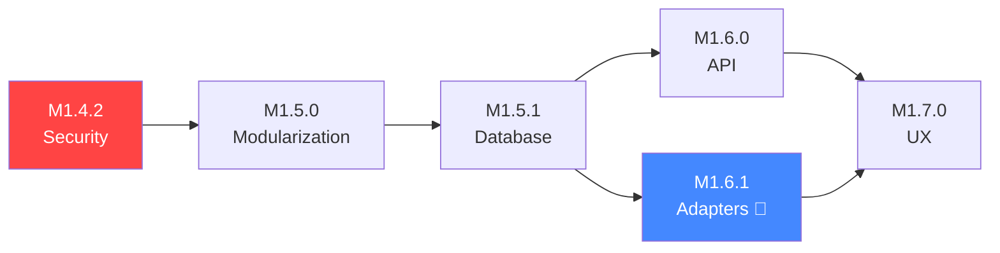

# 01 — Executive Summary

[← Powrót do README](./README.md) | [Następna: Wizja Architektury →](./02-architecture-vision.md)

---

## 🎯 Wizja Projektu

IOC Service ma stać się **referencyjną platformą Threat Intelligence** w organizacji — centralnym punktem agregacji, normalizacji i dystrybucji wskaźników kompromitacji (IOC). Projekt ewoluuje z solidnego, ale monolitycznego MVP (v1.4.1) do modularnej, bezpiecznej i skalowalnej platformy (v2.0).

### Mission Statement

> Dostarczyć zespołom bezpieczeństwa **jednolity, niezawodny i łatwo rozszerzalny** system zarządzania Threat Intelligence, który spełnia wymagania ISO 27001 i pozwala na dodanie nowego źródła danych w mniej niż 2 dni robocze.

---

## 🏆 Cele Biznesowe

### Cele Strategiczne

| # | Cel | Metryka sukcesu | Priorytet |
|---|-----|------------------|-----------|
| C1 | **Compliance ISO 27001** | 100% kontroli Annex A zaimplementowanych | 🔴 Critical |
| C2 | **Plugin Architecture** | Czas dodania integracji ≤2 dni | 🔴 Critical |
| C3 | **Production Readiness** | Uptime >99.9%, 0 critical vulnerabilities | 🟠 High |
| C4 | **Developer Experience** | Build <5min, deploy >1x/dzień | 🟡 Medium |
| C5 | **Operational Excellence** | Response time p95 <200ms | 🟡 Medium |

### Cele Taktyczne

1. **Zabezpieczyć panel administracyjny** (autentykacja, CSRF, RBAC) — M1.4.2
2. **Zmodularyzować monolityczny kod** (app/main.py: 2,555 → <500 LOC) — M1.5.0
3. **Ujednolicić schemat bazy danych** (single source of truth) — M1.5.1
4. **Wdrożyć Adapter Pattern** dla integracji (plug-and-play) — M1.6.1
5. **Przeprojektować UI/UX** (workflow-centric) — M1.7.0

---

## 🔑 Kluczowe Wyzwania i Rozwiązania

### Wyzwanie 1: Hardcoded Integracje 🔴

**Problem:** Każde źródło Threat Intelligence jest zaimplementowane jako osobny moduł z własną logiką HTTP, normalizacji i zapisu do bazy. Dodanie nowego źródła wymaga zmian w 4-6 plikach i ~2 tygodnie pracy.

**Rozwiązanie:** [Plugin Architecture z Adapter Pattern](./03-integration-architecture.md)
- `FeedAdapter` Protocol — standardowy kontrakt dla wszystkich connectorów
- `FeedAdapterRegistry` — dynamiczne odkrywanie i rejestracja adapterów
- Shared pipeline — wspólna logika normalizacji, deduplikacji, upsert
- Cel: nowy adapter = 1 plik + konfiguracja = ≤2 dni

### Wyzwanie 2: Brak Bezpieczeństwa /admin 🔴

**Problem:** Panel administracyjny jest publicznie dostępny bez autentykacji. Brak CSRF protection, brak audit trail. Blokuje certyfikację ISO 27001.

**Rozwiązanie:** [Security Hardening](./04-iso27001-compliance.md)
- Session-based authentication for admin/web UI + API auth path for machine clients
- RBAC (Role-Based Access Control): admin, operator, viewer
- CSRF tokens dla wszystkich state-changing operations
- Comprehensive audit logging (who, what, when, where, result)

### Wyzwanie 3: God Object — app/main.py 🟠

**Problem:** Główny plik aplikacji ma 2,555 LOC i zawiera routing, logikę biznesową, rendering HTML i konfigurację. Utrudnia testowanie, code review i współpracę.

**Rozwiązanie:** [Modularyzacja](./06-milestones-roadmap.md#m150---core-modularization)
- Split na dedykowane moduły: admin.py, sync_jobs.py, settings.py
- App factory pattern (main.py <500 LOC)
- Service layer z dependency injection
- Jinja templates zamiast inline HTML

### Wyzwanie 4: Dual Schema Management 🟡

**Problem:** Schema bazy danych zdefiniowana w dwóch miejscach: SQL files (database/init/*.sql) i SQLAlchemy ORM (app/models.py). Ryzyko schema drift.

**Rozwiązanie:** [Database Convergence](./06-milestones-roadmap.md#m151---database-schema-alignment)
- Alembic jako single source of truth
- Automated schema drift detection
- PostgreSQL-specific integration tests

---

## 💰 ROI i Wartość Biznesowa

### Analiza Kosztów vs. Korzyści

| Inwestycja | Story Points | Korzyść |
|------------|-------------|----------|
| M1.4.2 Security | ~34 SP | Odblokowanie ISO 27001, eliminacja ryzyka breach |
| M1.5.0 Modularization | ~40 SP | -50% czasu code review, -70% merge conflicts |
| M1.5.1 Database | ~26 SP | Eliminacja schema drift, +20% reliability |
| M1.6.0 API | ~30 SP | API stability, integrator experience |
| M1.6.1 Adapters 🎯 | ~55 SP | **Czas integracji: 2 tygodnie → 2 dni (85% redukcja)** |
| M1.7.0 UX | ~30 SP | User satisfaction, reduced training time |
| **TOTAL** | **~215 SP** | |

### Wartość biznesowa

1. **Oszczędność czasu** — przy 5 nowych integracji/rok: `5 × (10 dni - 2 dni) = 40 osobodni/rok`
2. **Redukcja ryzyka** — ISO 27001 compliance eliminuje ryzyko kar regulacyjnych
3. **Skalowalność zespołu** — modularyzacja umożliwia równoległą pracę 3-4 developerów
4. **Jakość** — test coverage >85% redukuje regression bugs o ~60%

---

## 📅 Timeline

```
2026 Q2 (kwiecień-czerwiec):
├── M1.4.2 — Security Hardening         (4-6 tygodni)  🔴 CRITICAL
└── M1.5.0 — Code Modularization        (4-6 tygodni)  🟠 HIGH

2026 Q3 (lipiec-wrzesień):
├── M1.5.1 — Database Schema Alignment   (3-4 tygodnie) 🟡 MEDIUM
└── M1.6.0 — API Modernization           (3-4 tygodnie) 🟡 MEDIUM

2026 Q4 (październik-grudzień):
├── M1.6.1 — Integration Adapters 🎯     (6-8 tygodni)  🔵 HIGH
└── M1.7.0 — UX Redesign                (4-6 tygodni)  🟣 LOW
```

### Zależności między milestones



---

## 👥 Stakeholders i Oczekiwania

| Stakeholder | Rola | Główne oczekiwanie | Sekcja referencji |
|-------------|------|--------------------|---------|
| **CISO** | Chief Information Security Officer | ISO 27001 compliance, zero critical vulns | [04-iso27001](./04-iso27001-compliance.md) |
| **SOC Team Lead** | Security Operations | Szybkie dodawanie nowych feed sources | [03-integration](./03-integration-architecture.md) |
| **Security Analyst** | Użytkownik końcowy | Intuicyjne UI, szybkie wyszukiwanie IOC | [07-roles/frontend](./07-roles/frontend-developer.md) |
| **DevOps Lead** | Infrastructure | Automated deployment, monitoring, HA | [07-roles/devops](./07-roles/devops-engineer.md) |
| **Tech Lead** | Architektura | Clean code, modularność, testability | [02-architecture](./02-architecture-vision.md) |
| **Product Owner** | Priorytetyzacja | ROI, feature roadmap, user satisfaction | [07-roles/product-owner](./07-roles/product-owner.md) |

---

## ✅ Kryteria Sukcesu Projektu

### Must Have (v2.0 Release)
- [ ] ISO 27001 compliance score: 100%
- [ ] Czas dodania nowej integracji: ≤2 dni
- [ ] Admin panel zabezpieczony (auth + CSRF + RBAC)
- [ ] app/main.py <500 LOC
- [ ] Test coverage >85%
- [ ] 0 critical/high security vulnerabilities
- [ ] API versioning (`/api/v1/`)

### Should Have
- [ ] OpenAPI specification opublikowana
- [ ] Uptime >99.9% (SLA)
- [ ] Response time p95 <200ms
- [ ] Automated CI/CD pipeline

### Nice to Have
- [ ] Kubernetes deployment (migration from Docker Compose)
- [ ] SIEM integration (bidirectional)
- [ ] Real-time streaming exports

---

[← Powrót do README](./README.md) | [Następna: Wizja Architektury →](./02-architecture-vision.md)
