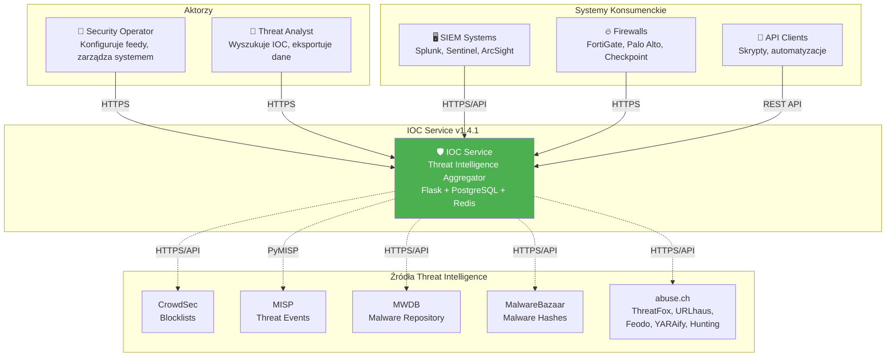
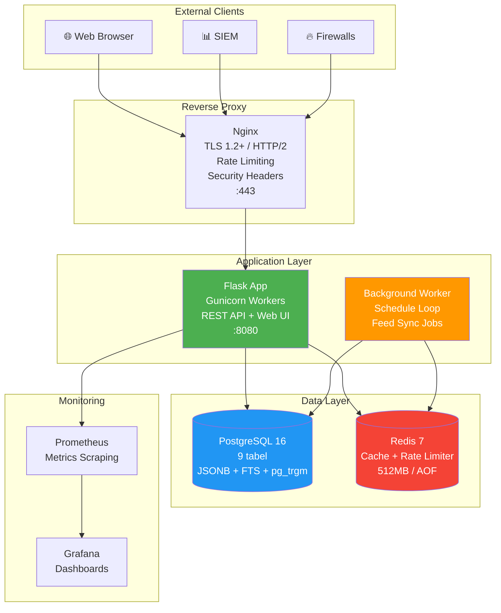
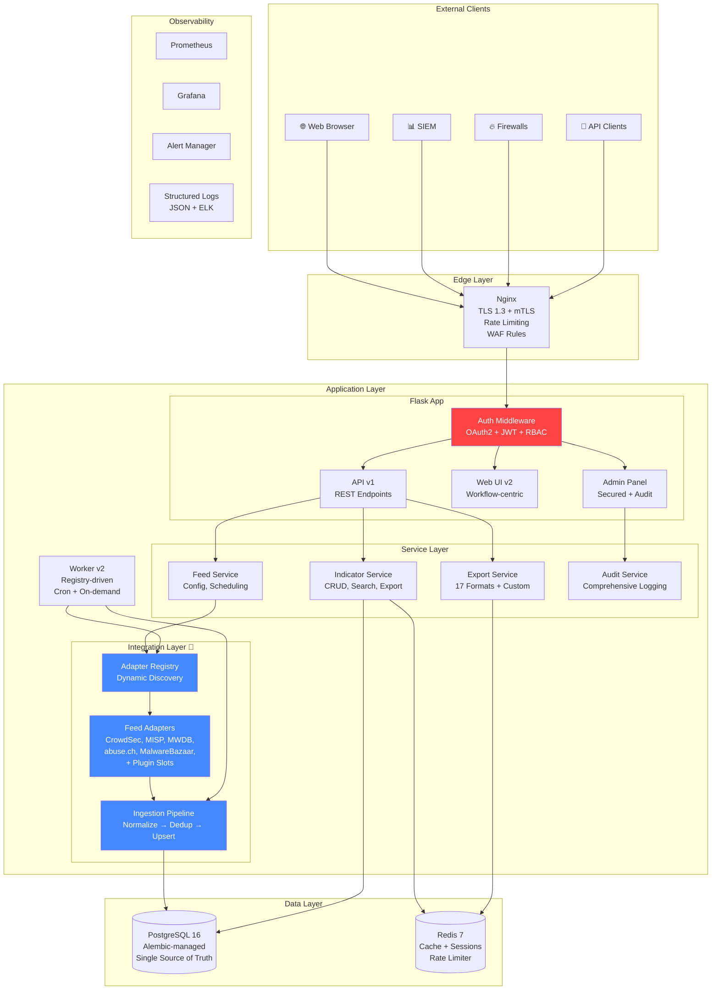

# 02 — Wizja Architektury

[← Powrót do README](./README.md) | [← Executive Summary](./01-executive-summary.md) | [Następna: Architektura Integracji →](./03-integration-architecture.md)

---

## 📐 Obecna Architektura (v1.4.1)

### Opis

IOC Service v1.4.1 to **monolit modularny** z Worker Queue. Aplikacja składa się z trzech głównych komponentów: Flask API (HTTP), Background Worker (scheduled jobs) i Data Layer (PostgreSQL + Redis). Komunikacja jest synchroniczna, a integracje hardcoded w osobnych modułach service/*.

### Diagram C4 — Context (Poziom 1)



### Diagram C4 — Container (Poziom 2)



### Problemy obecnej architektury

| Problem | Opis | Impact | Priorytet |
|---------|------|--------|-----------|
| God Object | `app/main.py` — 2,555 LOC | Trudne testowanie, merge conflicts | 🔴 Critical |
| Hardcoded integracje | Każde źródło w osobnym module bez wspólnego kontraktu | 2 tygodnie na nową integrację | 🔴 Critical |
| Brak auth /admin | Panel admina publicznie dostępny | ISO 27001 violation | 🔴 Critical |
| Dual schema | SQL + ORM bez synchronizacji | Schema drift risk | 🟡 Medium |
| Brak API versioning | Endpointy bez prefixu wersji | Breaking changes risk | 🟡 Medium |
| Monolityczny Config | 162 LOC, 100+ pól w jednej klasie | Trudne zarządzanie | 🟢 Low |

---

## 🎯 Docelowa Architektura (v2.0)

### Opis

Docelowa architektura zachowuje **modularny monolit** (nie mikroserwisy — to overengineering dla tego projektu), ale wprowadza:
1. **Plugin Architecture** — adapter pattern dla integracji
2. **Service Layer** — czyste separation of concerns
3. **Security Layer** — authentication, authorization, audit
4. **Configuration Layer** — typed, grouped configuration
5. **API Layer** — versioned, documented, stable

### Diagram C4 — Docelowa Container Architecture



---

## 📋 Kluczowe Decyzje Architektoniczne (ADR)

### ADR-001: Modularny Monolit vs. Mikroserwisy

**Status:** Zaakceptowana  
**Data:** 2026-04-07  
**Kontekst:** Aplikacja ma ~10,400 LOC i zespół 3-6 osób. Rozważano migrację do mikroserwisów.

**Decyzja:** Pozostajemy przy **modularnym monolicie** z czystymi granicami modułów.

**Uzasadnienie:**
- Zespół jest za mały na overhead mikroserwisów (service discovery, distributed tracing, API gateway)
- Latencja wewnętrzna jest krytyczna (agregacja z 10 źródeł)
- Modularny monolit daje 80% korzyści mikroserwisów przy 20% kosztów
- Przyszła migracja do mikroserwisów będzie łatwiejsza dzięki adapter pattern

**Konsekwencje:**
- ✅ Prostsza infrastruktura (Docker Compose)
- ✅ Brak problemów z distributed transactions
- ✅ Łatwiejsze debugging i profiling
- ⚠️ Trzeba pilnować granic modułów (linting, architecture tests)
- ⚠️ Skalowanie pionowe, nie poziome (na razie wystarczające)

---

### ADR-002: Adapter Pattern dla Integracji

**Status:** Zaakceptowana  
**Data:** 2026-04-07  
**Kontekst:** Dodanie nowej integracji zajmuje ~2 tygodnie. Każdy connector ma własną sygnaturę, logikę retry, normalizacji.

**Decyzja:** Wdrożyć **FeedAdapter Protocol** z centralnym registry i wspólnym ingestion pipeline.

**Uzasadnienie:**
- Standaryzacja kontraktu eliminuje duplikację (5× upsert logic, 5× deactivation)
- Runtime discovery umożliwia hot-reload konfiguracji feedów
- Fake adapters dramatycznie upraszczają testowanie
- Czas dodania integracji: 2 tygodnie → 2 dni

**Szczegóły:** [03-integration-architecture.md](./03-integration-architecture.md)

---

### ADR-003: Alembic jako Single Source of Truth dla Schema

**Status:** Zaakceptowana  
**Data:** 2026-04-07  
**Kontekst:** Schema zdefiniowana w 2 miejscach: SQL files i ORM models. Ryzyko schema drift.

**Decyzja:** **Alembic migrations** jako jedyne źródło prawdy. ORM models generowane z migracji.

**Uzasadnienie:**
- Alembic daje pełną historię zmian schema
- Automated rollback (downgrade)
- CI/CD integration (auto-migrate on deploy)
- Eliminacja database/init/*.sql (legacy)

**Konsekwencje:**
- ✅ Jedna ścieżka inicjalizacji DB
- ✅ Automated schema drift detection w CI
- ⚠️ Wymaga migracji istniejących SQL files do Alembic
- ⚠️ PostgreSQL-specific features (triggers, functions) muszą być w Alembic

---

### ADR-004: OAuth2 + Session-based Auth dla Admin

**Status:** Zaakceptowana  
**Data:** 2026-04-07  
**Kontekst:** Admin panel publicznie dostępny. Potrzebna autentykacja zgodna z ISO 27001.

**Decyzja:** **Session-based authentication** z opcjonalnym OAuth2/OIDC provider.

**Uzasadnienie:**
- Session-based jest prostsze dla Web UI (cookie-based)
- OAuth2/OIDC pozwala na integrację z corporate IdP (Azure AD, Keycloak)
- JWT dla API authentication (bearer tokens)
- RBAC: admin, operator, viewer

**Konsekwencje:**
- ✅ ISO 27001 A.9.2.1, A.9.4.1 compliance
- ✅ Audit trail per user
- ⚠️ Session management (Redis backend)
- ⚠️ Token rotation i revocation

---

### ADR-005: Flask vs. FastAPI

**Status:** Zaakceptowana (Flask remains)  
**Data:** 2026-04-07  
**Kontekst:** Rozważano migrację z Flask do FastAPI dla lepszego async support i auto-documentation.

**Decyzja:** **Pozostajemy przy Flask** z Flask-RESTX dla auto-documentation.

**Uzasadnienie:**
- Migracja Flask→FastAPI to ~3-4 tygodnie pracy bez nowej funkcjonalności
- Flask 3.x ma async view support
- Flask-RESTX daje Swagger/OpenAPI generation
- Zespół zna Flask, learning curve dla FastAPI opóźniłby delivery
- Worker jest I/O-bound (HTTP calls), nie CPU-bound — async nie da dramatycznej poprawy

**Konsekwencje:**
- ✅ Brak risk migracji framework
- ✅ Szybszy time-to-market
- ⚠️ Brak natywnego async (Gunicorn workers kompensują)
- ⚠️ Flask-Limiter zamiast wbudowanego middleware

---

### ADR-006: Strategia Versioning API

**Status:** Zaakceptowana  
**Data:** 2026-04-07  
**Kontekst:** Brak wersjonowania API. Zmiany mogą łamać integracje klientów SIEM/firewall.

**Decyzja:** **URL-based versioning** (`/api/v1/`) z backward compatibility.

**Uzasadnienie:**
- URL versioning jest najprostsze i najbardziej czytelne
- Header-based versioning (Accept: application/vnd.ioc.v1+json) — za skomplikowane
- Stare endpointy (`/indicators`, `/export`) → redirect do `/api/v1/`

**Konsekwencje:**
- ✅ Breaking changes izolowane per version
- ✅ Klienci mogą migrować w swoim tempie
- ⚠️ Maintenance dwóch wersji API w okresie przejściowym

---

## 🔄 Ewolucja: Od Obecnego Stanu do Docelowego

### Faza 1: Bezpieczeństwo (M1.4.2)

```
Obecny stan          →    Po M1.4.2
─────────────────────────────────────
/admin: publiczny    →    /admin: auth required
POST bez CSRF       →    CSRF tokens
Brak audit trail    →    Comprehensive audit
SECRET_KEY: ok      →    SECRET_KEY: enforced
```

### Faza 2: Modularyzacja (M1.5.0)

```
Obecny stan               →    Po M1.5.0
──────────────────────────────────────────
main.py: 2,555 LOC       →    main.py: <500 LOC
ops.py: 1,529 LOC        →    admin.py + sync.py + settings.py
Inline HTML               →    Jinja templates
Logika w routes           →    Service Layer
```

### Faza 3: Database (M1.5.1)

```
Obecny stan               →    Po M1.5.1
──────────────────────────────────────────
SQL files + ORM           →    Alembic only
Brak FK constraints       →    Full referential integrity
Brak PG-specific tests    →    JSONB, FTS, triggers tested
```

### Faza 4: API (M1.6.0)

```
Obecny stan               →    Po M1.6.0
──────────────────────────────────────────
/indicators               →    /api/v1/indicators
Brak OpenAPI              →    Swagger UI published
Config: 1 mega-class      →    Grouped dataclasses
requirements.txt          →    pyproject.toml
```

### Faza 5: Adaptery 🎯 (M1.6.1)

```
Obecny stan               →    Po M1.6.1
──────────────────────────────────────────
5 hardcoded connectors    →    FeedAdapter Protocol
Duplikacja upsert logic   →    Shared Ingestion Pipeline
Hardcoded scheduler       →    Registry-driven scheduling
Brak capabilities         →    Runtime metadata query
2 tygodnie na integrację  →    2 dni na integrację
```

### Faza 6: UX (M1.7.0)

```
Obecny stan               →    Po M1.7.0
──────────────────────────────────────────
Tech-centric UI           →    Workflow-centric UI
Admin + Business mixed    →    Separated concerns
Brak workflow guidance    →    Guided user experience
```

---

## 🏗️ Strategia Migracji: Incremental

### Dlaczego NIE Big Bang?

1. **Ryzyko** — jednorazowa migracja całego systemu to 6+ miesięcy bez widocznych efektów
2. **Feedback** — incremental delivery pozwala na korektę kursu
3. **Morale** — zespół widzi postępy co 4-6 tygodni
4. **Backward compatibility** — stare integracje działają podczas migracji

### Zasady migracji

1. **Feature flags** — nowe funkcje za flagami, stary kod jako fallback
2. **Strangler fig pattern** — nowe moduły owijają stary kod, stopniowo go zastępując
3. **Parallel run** — nowe adaptery działają równolegle ze starymi connectorami
4. **Canary releases** — nowe wersje wdrażane na podzbiór feedów
5. **Rollback plan** — każdy milestone ma plan rollback (max 30 min)

---

## 📏 Architectural Principles

### P1: Separation of Concerns
Każdy moduł ma jedną, jasno zdefiniowaną odpowiedzialność. Routes nie zawierają logiki biznesowej. Services nie wiedzą o HTTP.

### P2: Dependency Inversion
Moduły zależą od abstrakcji (Protocol, ABC), nie od konkretnych implementacji. Core code nigdy nie importuje bezpośrednio adaptera.

### P3: Open/Closed Principle
System otwarty na rozszerzenia (nowe adaptery, nowe formaty eksportu), zamknięty na modyfikacje (core pipeline nie zmienia się przy dodaniu adaptera).

### P4: Fail Fast, Fail Loud
Brakujące konfiguracje, nieprawidłowe secrets, nieosiągalne zależności — system informuje od razu, nie ignoruje cicho.

### P5: Defense in Depth
Bezpieczeństwo na każdej warstwie: nginx (WAF), app (auth + CSRF), service (validation), DB (parameterized queries).

### P6: Observability by Default
Każda operacja generuje metryki, logi i audit trail. Brak „cichych" operacji.

---

## ⚙️ Architectural Constraints

| Constraint | Uzasadnienie |
|------------|-------------|
| Python 3.11+ | Ecosystem, team expertise, PyMISP dependency |
| PostgreSQL 16 | JSONB, FTS, proven reliability, existing data |
| Redis 7 | Cache + rate limiter, already deployed |
| Docker Compose | Current infra, K8s migration optional (v2.1+) |
| Flask 3.x | Team expertise, migration cost too high |
| Modularny monolit | Team size, complexity budget |
| ISO 27001 | Regulatory requirement |

---

[← Executive Summary](./01-executive-summary.md) | [Następna: Architektura Integracji →](./03-integration-architecture.md)
