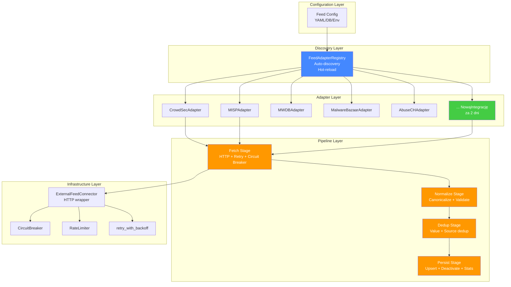
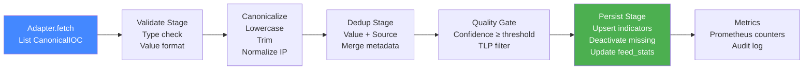
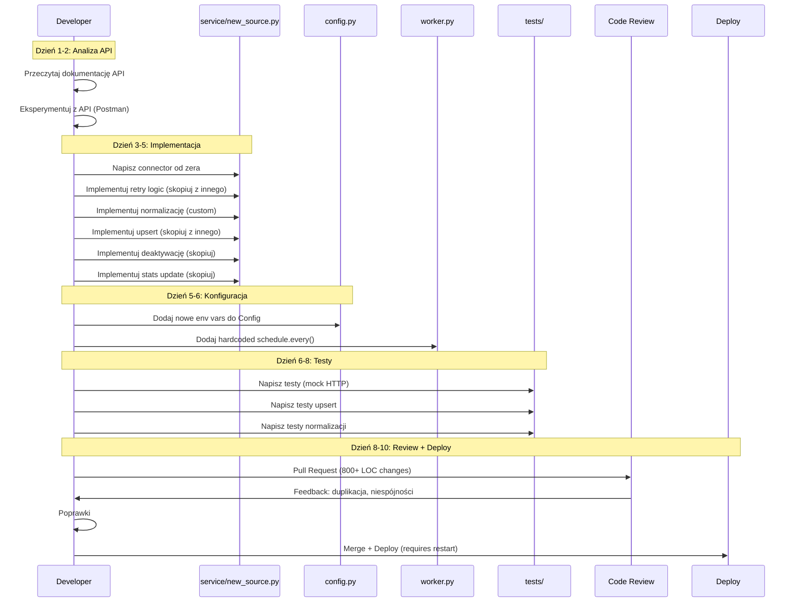
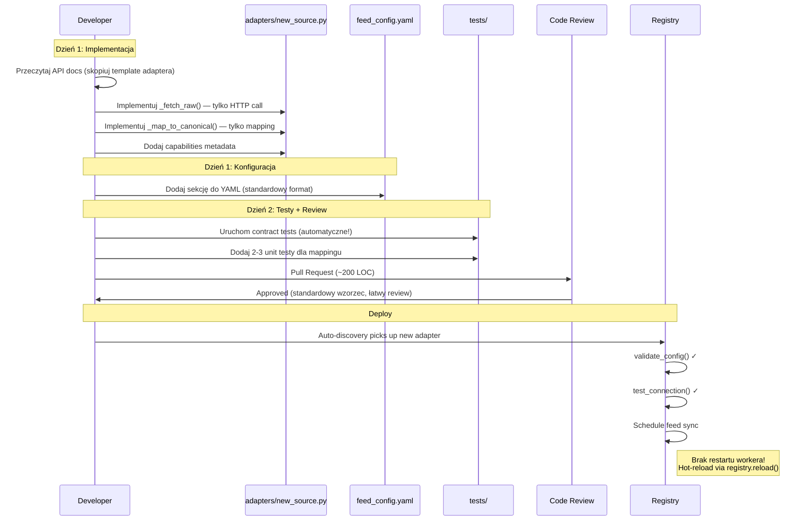

# 03 — Architektura Integracji 🔑 KLUCZOWA SEKCJA

[← Powrót do README](./README.md) | [← Wizja Architektury](./02-architecture-vision.md) | [Następna: ISO 27001 →](./04-iso27001-compliance.md)

---

> **⚠️ To jest najważniejsza sekcja tego dokumentu.**  
> Architektura integracji to fundament całego projektu — decyduje o tym, jak szybko można dodawać nowe źródła Threat Intelligence i jak łatwo utrzymywać istniejące.

---

## 🔍 Problem Statement

### Stan obecny

Każda integracja z zewnętrznym źródłem Threat Intelligence jest **hardcoded** jako osobny moduł w `app/services/`. Każdy connector implementuje własną logikę:
- Pobierania danych (HTTP, różne API)
- Normalizacji (mapowanie pól external → internal)
- Deduplikacji (własne reguły)
- Zapisu do DB (powtórzony upsert pattern)
- Dezaktywacji brakujących IOC
- Aktualizacji statystyk feedu

### Konkretne problemy

| Problem | Impact | Koszt |
|---------|--------|-------|
| **5× zduplikowana logika upsert** | Niespójne zachowanie między connectorami | Bug w jednym = bug we wszystkich |
| **5× zduplikowana deaktywacja IOC** | Różne podejścia do is_active lifecycle | Dane niespójne |
| **Brak wspólnego kontraktu** | Każdy connector ma inną sygnaturę | Nie da się testować generycznie |
| **Hardcoded scheduler** | Restart workera przy każdej zmianie | Downtime przy konfiguracji |
| **Brak capability metadata** | Nie wiadomo co connector wspiera | Trudna walidacja config |
| **Brak test_connection** | Nie można zweryfikować config przed deploy | Failed feeds w runtime |

### Ile kosztuje dodanie nowej integracji DZIŚ?

```
Krok 1: Analiza API zewnętrznego źródła          ~2 dni
Krok 2: Napisanie connectora (service/*.py)       ~3 dni
Krok 3: Dodanie konfiguracji do Config class      ~0.5 dnia
Krok 4: Rejestracja w worker scheduler            ~0.5 dnia
Krok 5: Dodanie testów                            ~2 dni
Krok 6: Dodanie monitoringu/metryk                ~1 dzień
Krok 7: Code review + poprawki                    ~1 dzień
─────────────────────────────────────────────
RAZEM:                                            ~10 dni roboczych (2 tygodnie)
```

### Ile POWINNO kosztować?

```
Krok 1: Analiza API zewnętrznego źródła          ~0.5 dnia (reuse adapter template)
Krok 2: Implementacja FeedAdapter                 ~1 dzień (tylko fetch + normalize)
Krok 3: Konfiguracja YAML/env                     ~0.5 dnia (standardowy format)
Krok 4: Testy (contract + unit)                   ~0.5 dnia (reuse test harness)
─────────────────────────────────────────────
RAZEM:                                            ~2 dni robocze (80% redukcja)
```

---

## 🏗️ Plugin System Design

### Przegląd warstw



### Zasady projektowe

1. **Adapter zna TYLKO swoje API** — jak pobrać dane i jak je zmapować na CanonicalIOC
2. **Pipeline jest WSPÓLNY** — normalizacja, deduplikacja, upsert, deaktywacja
3. **Registry jest DYNAMICZNY** — auto-discovery, runtime reload
4. **Config jest DEKLARATYWNY** — YAML/env/DB, nie kod Python
5. **Infrastructure jest SHARED** — retry, circuit breaker, rate limiter

---

## 🔌 Adapter Pattern Implementation

### Core Contracts (Protokoły)

```python
"""
app/adapters/contracts.py — Definicje kontraktów dla feed adapters.
Ten plik to FOUNDATION całej architektury integracji.
"""

from __future__ import annotations

import abc
from dataclasses import dataclass, field
from datetime import datetime
from enum import Enum
from typing import Any, Dict, List, Optional, Protocol, runtime_checkable


# ─── Value Objects ────────────────────────────────────────────────

class IOCType(str, Enum):
    """Standardowe typy IOC wspierane przez system."""
    IP = "ip"
    DOMAIN = "domain"
    URL = "url"
    HASH_MD5 = "hash_md5"
    HASH_SHA1 = "hash_sha1"
    HASH_SHA256 = "hash_sha256"
    EMAIL = "email"
    FILENAME = "filename"
    YARA = "yara"
    JA3 = "ja3"
    CIDR = "cidr"
    UNKNOWN = "unknown"


class TLPLevel(str, Enum):
    """Traffic Light Protocol levels."""
    WHITE = "WHITE"    # TLP:CLEAR w TLP 2.0
    GREEN = "GREEN"
    AMBER = "AMBER"
    AMBER_STRICT = "AMBER+STRICT"
    RED = "RED"


class FetchStopReason(str, Enum):
    """Powód zakończenia fetch operation."""
    COMPLETED = "completed"           # Wszystkie dane pobrane
    LIMIT_REACHED = "limit_reached"   # Osiągnięto limit
    TIME_WINDOW = "time_window"       # Osiągnięto granicę czasową
    NO_MORE_DATA = "no_more_data"     # Źródło nie ma więcej danych
    ERROR = "error"                   # Błąd przerwał pobieranie
    CIRCUIT_OPEN = "circuit_open"     # Circuit breaker otwarty


# ─── Data Transfer Objects ────────────────────────────────────────

@dataclass(frozen=True)
class CanonicalIOC:
    """
    Znormalizowana reprezentacja IOC — wewnętrzny format systemu.
    KAŻDY adapter musi mapować swoje dane na ten format.
    
    Immutable (frozen=True) dla thread safety i hashability.
    """
    value: str                              # Wartość IOC (IP, hash, URL, etc.)
    type: IOCType                           # Typ IOC
    source: str                             # ID źródła (np. "mwdb", "crowdsec")
    source_ref: str                         # ID w zewnętrznym systemie
    confidence: int = 50                    # 0-100, domyślnie 50
    tlp: TLPLevel = TLPLevel.GREEN         # TLP level
    tags: tuple[str, ...] = ()             # Immutable tags
    metadata: Dict[str, Any] = field(default_factory=dict)  # Dodatkowe dane
    first_seen: Optional[datetime] = None   # Pierwsze wystąpienie
    last_seen: Optional[datetime] = None    # Ostatnie wystąpienie
    
    def __post_init__(self):
        """Walidacja przy tworzeniu."""
        if not self.value or not self.value.strip():
            raise ValueError("IOC value cannot be empty")
        if not 0 <= self.confidence <= 100:
            raise ValueError(f"Confidence must be 0-100, got {self.confidence}")


@dataclass(frozen=True)
class FeedCapabilities:
    """
    Metadata o możliwościach adaptera.
    Używane przez UI do wyświetlania opcji, przez walidator do sprawdzania config.
    """
    supported_ioc_types: tuple[IOCType, ...]    # Jakie typy IOC dostarcza
    supported_tlp_levels: tuple[TLPLevel, ...]  # Jakie TLP wspiera
    requires_auth: bool = True                   # Czy wymaga API key/token
    supports_time_filtering: bool = False        # Czy wspiera since/until
    supports_incremental: bool = False           # Czy wspiera delta fetch
    supports_tags_filter: bool = False           # Czy można filtrować po tagach
    max_fetch_limit: Optional[int] = None        # Max items per fetch (None = no limit)
    rate_limit_per_minute: int = 60              # Suggested rate limit
    
    @property
    def description(self) -> str:
        types = ", ".join(t.value for t in self.supported_ioc_types)
        return f"IOC types: [{types}], Auth: {self.requires_auth}, Incremental: {self.supports_incremental}"


@dataclass
class FeedConfig:
    """
    Konfiguracja feeda — ładowana z YAML/DB/env.
    Jeden FeedConfig per aktywna instancja adaptera.
    """
    source_id: str                          # Musi matchować adapter.source_id
    enabled: bool = True                    # Czy feed jest aktywny
    schedule_cron: str = "*/30 * * * *"     # Cron expression (co 30 min)
    base_url: Optional[str] = None          # Base URL (override default)
    auth: Dict[str, Any] = field(default_factory=dict)  # {api_key, token, user, pass}
    filters: Dict[str, Any] = field(default_factory=dict)  # Source-specific filters
    limits: Dict[str, int] = field(default_factory=dict)   # {max_items, timeout_s, ...}
    custom_headers: Dict[str, str] = field(default_factory=dict)
    proxy: Optional[str] = None             # HTTP proxy URL
    
    # Resilience config (overrides per-source)
    circuit_fail_threshold: int = 3
    circuit_cooldown_s: int = 300
    retry_max_attempts: int = 4
    retry_base_delay_s: float = 1.0


@dataclass
class FetchContext:
    """
    Runtime context dla fetch operation.
    Przekazywany przez pipeline, nie tworzony przez adapter.
    """
    since: Optional[datetime] = None        # Pobierz od (incremental)
    until: Optional[datetime] = None        # Pobierz do
    limit: int = 10000                      # Max items to fetch
    tags: tuple[str, ...] = ()              # Filter by tags
    is_full_sync: bool = False              # Force full sync (ignore since)
    correlation_id: str = ""                # Tracking ID for logs


@dataclass
class FetchStats:
    """Telemetria z operacji fetch."""
    total_fetched: int = 0
    valid_count: int = 0
    filtered_count: int = 0
    error_count: int = 0
    api_calls_made: int = 0
    duration_ms: int = 0
    bytes_received: int = 0


@dataclass
class FetchResult:
    """Wynik operacji fetch — zwracany przez adapter."""
    items: List[CanonicalIOC]
    stats: FetchStats
    stop_reason: FetchStopReason = FetchStopReason.COMPLETED
    errors: List[str] = field(default_factory=list)
    next_cursor: Optional[str] = None       # Dla paginacji (opcjonalne)
    
    @property
    def is_success(self) -> bool:
        return self.stop_reason != FetchStopReason.ERROR
    
    @property
    def summary(self) -> str:
        return (
            f"Fetched {self.stats.total_fetched}, "
            f"valid {self.stats.valid_count}, "
            f"filtered {self.stats.filtered_count}, "
            f"errors {self.stats.error_count}, "
            f"reason: {self.stop_reason.value}"
        )


@dataclass
class ConnectionTestResult:
    """Wynik testu połączenia."""
    success: bool
    message: str
    latency_ms: int = 0
    server_version: Optional[str] = None
    available_feeds: List[str] = field(default_factory=list)


@dataclass
class ConfigValidationResult:
    """Wynik walidacji konfiguracji."""
    valid: bool
    errors: List[str] = field(default_factory=list)
    warnings: List[str] = field(default_factory=list)


# ─── Adapter Protocol ────────────────────────────────────────────

@runtime_checkable
class FeedAdapter(Protocol):
    """
    🔑 GŁÓWNY KONTRAKT — każdy adapter MUSI implementować ten protokół.
    
    Protocol (nie ABC) pozwala na structural typing — adapter nie musi
    dziedziczyć z tego class, wystarczy że ma te metody.
    
    Lifecycle:
        1. Registry discovers adapter (auto-import)
        2. validate_config(config) → check before use
        3. test_connection(config) → verify connectivity
        4. fetch(config, context) → main data retrieval
    """
    
    @property
    def source_id(self) -> str:
        """
        Unikalny identyfikator źródła.
        Musi być lowercase, alphanumeric + underscore.
        Przykłady: 'crowdsec', 'misp', 'mwdb', 'abusech_threatfox'
        """
        ...
    
    @property
    def display_name(self) -> str:
        """Czytelna nazwa dla UI. Przykład: 'CrowdSec Blocklists'"""
        ...
    
    @property
    def capabilities(self) -> FeedCapabilities:
        """Metadata o możliwościach adaptera."""
        ...
    
    def validate_config(self, config: FeedConfig) -> ConfigValidationResult:
        """
        Walidacja konfiguracji BEZ połączenia z external API.
        
        Sprawdza:
        - Wymagane pola (api_key jeśli requires_auth)
        - Format URL
        - Poprawność filtrów
        
        MUSI być szybkie (<100ms).
        """
        ...
    
    def test_connection(self, config: FeedConfig) -> ConnectionTestResult:
        """
        Test połączenia z external API.
        
        Wykonuje lightweight request (np. GET /health, GET /api/version).
        MUSI mieć timeout <5s.
        """
        ...
    
    def fetch(self, config: FeedConfig, context: FetchContext) -> FetchResult:
        """
        Główna metoda — pobiera dane z external API i mapuje na CanonicalIOC.
        
        TYLKO:
        1. Pobiera surowe dane z API
        2. Mapuje na CanonicalIOC
        3. Zwraca FetchResult
        
        NIE ROBI:
        - Zapisu do DB (pipeline responsibility)
        - Deduplikacji (pipeline responsibility)
        - Deaktywacji starych IOC (pipeline responsibility)
        
        Obsługa błędów:
        - HTTP errors → FetchResult z stop_reason=ERROR
        - Mapping errors → skip item, increment error_count
        - Timeout → FetchResult z partial data
        """
        ...
```

### Base Adapter (Wspólna implementacja)

```python
"""
app/adapters/base.py — Bazowa klasa z shared functionality.
Adaptery MOGĄ (ale nie muszą) dziedziczyć z BaseFeedAdapter.
"""

import logging
import time
from typing import Any, Dict, List, Optional

from app.adapters.contracts import (
    CanonicalIOC,
    ConfigValidationResult,
    ConnectionTestResult,
    FeedAdapter,
    FeedCapabilities,
    FeedConfig,
    FetchContext,
    FetchResult,
    FetchStats,
    FetchStopReason,
)
from app.services.common import ExternalFeedConnector


class BaseFeedAdapter:
    """
    Bazowa implementacja z shared functionality.
    
    Zapewnia:
    - Standardowe logowanie
    - ExternalFeedConnector (retry + throttle + circuit breaker)
    - Wspólną logikę walidacji
    - Metryki
    
    Adapter musi nadpisać:
    - source_id, display_name, capabilities (properties)
    - _fetch_raw(config, context) → List[Dict] (surowe dane z API)
    - _map_to_canonical(raw_item, config) → Optional[CanonicalIOC]
    
    Opcjonalnie:
    - _validate_config_specific(config) → List[str] (dodatkowa walidacja)
    - _test_connection_impl(config) → ConnectionTestResult
    """
    
    def __init__(self):
        self._logger = logging.getLogger(f"adapter.{self.source_id}")
        self._connector: Optional[ExternalFeedConnector] = None
    
    def _get_connector(self, config: FeedConfig) -> ExternalFeedConnector:
        """Lazy-init HTTP connector z config."""
        if self._connector is None:
            self._connector = ExternalFeedConnector(
                source=self.source_id,
                session=None,  # Will create new session
                retry_fn=None,  # Use default retry_with_backoff
            )
        return self._connector
    
    # ─── Public API (FeedAdapter Protocol) ────────────────────────
    
    def validate_config(self, config: FeedConfig) -> ConfigValidationResult:
        """Wspólna + specyficzna walidacja."""
        errors = []
        warnings = []
        
        # Wspólna walidacja
        if config.source_id != self.source_id:
            errors.append(
                f"Config source_id '{config.source_id}' != adapter '{self.source_id}'"
            )
        
        if self.capabilities.requires_auth:
            if not config.auth or not config.auth.get("api_key"):
                errors.append(f"API key required for {self.display_name}")
        
        if config.base_url and not config.base_url.startswith("http"):
            errors.append(f"Invalid base_url: {config.base_url}")
        
        # Specyficzna walidacja (override w subclass)
        specific_errors = self._validate_config_specific(config)
        errors.extend(specific_errors)
        
        return ConfigValidationResult(
            valid=len(errors) == 0,
            errors=errors,
            warnings=warnings,
        )
    
    def test_connection(self, config: FeedConfig) -> ConnectionTestResult:
        """Test połączenia z timeout 5s."""
        start = time.monotonic()
        try:
            result = self._test_connection_impl(config)
            result.latency_ms = int((time.monotonic() - start) * 1000)
            return result
        except Exception as e:
            latency = int((time.monotonic() - start) * 1000)
            self._logger.warning(
                "connection_test_failed",
                extra={"error": str(e), "latency_ms": latency},
            )
            return ConnectionTestResult(
                success=False,
                message=f"Connection failed: {str(e)}",
                latency_ms=latency,
            )
    
    def fetch(self, config: FeedConfig, context: FetchContext) -> FetchResult:
        """
        Template Method: fetch_raw → map → collect → return.
        Subclass implementuje _fetch_raw() i _map_to_canonical().
        """
        start = time.monotonic()
        stats = FetchStats()
        items: List[CanonicalIOC] = []
        errors: List[str] = []
        stop_reason = FetchStopReason.COMPLETED
        
        try:
            # 1. Fetch raw data from external API
            self._logger.info(
                "fetch_start",
                extra={
                    "source": self.source_id,
                    "since": str(context.since),
                    "limit": context.limit,
                    "correlation_id": context.correlation_id,
                },
            )
            
            raw_items = self._fetch_raw(config, context)
            stats.total_fetched = len(raw_items)
            
            # 2. Map each item to CanonicalIOC
            for idx, raw_item in enumerate(raw_items):
                try:
                    canonical = self._map_to_canonical(raw_item, config)
                    if canonical is not None:
                        items.append(canonical)
                        stats.valid_count += 1
                    else:
                        stats.filtered_count += 1
                except Exception as e:
                    stats.error_count += 1
                    errors.append(f"Item {idx}: {str(e)}")
                    self._logger.debug(
                        "map_error",
                        extra={"index": idx, "error": str(e)},
                    )
            
            # 3. Check if limit reached
            if len(items) >= context.limit:
                stop_reason = FetchStopReason.LIMIT_REACHED
                items = items[:context.limit]
            
        except Exception as e:
            stop_reason = FetchStopReason.ERROR
            errors.append(f"Fetch failed: {str(e)}")
            self._logger.error(
                "fetch_failed",
                extra={"source": self.source_id, "error": str(e)},
                exc_info=True,
            )
        
        stats.duration_ms = int((time.monotonic() - start) * 1000)
        
        result = FetchResult(
            items=items,
            stats=stats,
            stop_reason=stop_reason,
            errors=errors,
        )
        
        self._logger.info(
            "fetch_complete",
            extra={
                "source": self.source_id,
                "summary": result.summary,
                "duration_ms": stats.duration_ms,
            },
        )
        
        return result
    
    # ─── Extension Points (override w subclass) ──────────────────
    
    def _fetch_raw(
        self, config: FeedConfig, context: FetchContext
    ) -> List[Dict[str, Any]]:
        """
        MUST OVERRIDE: Pobierz surowe dane z external API.
        Zwróć listę dictów (raw API response items).
        """
        raise NotImplementedError
    
    def _map_to_canonical(
        self, raw_item: Dict[str, Any], config: FeedConfig
    ) -> Optional[CanonicalIOC]:
        """
        MUST OVERRIDE: Mapuj surowy item na CanonicalIOC.
        Zwróć None aby odfiltrować item.
        """
        raise NotImplementedError
    
    def _validate_config_specific(self, config: FeedConfig) -> List[str]:
        """OPTIONAL OVERRIDE: Dodatkowa walidacja specyficzna dla adaptera."""
        return []
    
    def _test_connection_impl(self, config: FeedConfig) -> ConnectionTestResult:
        """OPTIONAL OVERRIDE: Implementacja testu połączenia."""
        return ConnectionTestResult(
            success=True,
            message="Default test (no specific implementation)",
        )
```

### Przykładowy kompletny adapter: CrowdSec

```python
"""
app/adapters/crowdsec.py — CrowdSec Blocklist Adapter.
Przykład kompletnej implementacji FeedAdapter.

Czas implementacji: ~4h (wzorzec do naśladowania dla nowych adapterów).
"""

import ipaddress
from datetime import datetime, timezone
from typing import Any, Dict, List, Optional

from app.adapters.base import BaseFeedAdapter
from app.adapters.contracts import (
    CanonicalIOC,
    ConfigValidationResult,
    ConnectionTestResult,
    FeedCapabilities,
    FeedConfig,
    FetchContext,
    IOCType,
    TLPLevel,
)


class CrowdSecAdapter(BaseFeedAdapter):
    """
    Adapter dla CrowdSec Community Blocklists.
    
    API: https://cti.api.crowdsec.net/v2/smoke
    Auth: API key (header: x-api-key)
    Data: IP addresses from community-driven blocklists
    Rate limit: 40 req/min (free tier), 100 req/min (premium)
    """
    
    # Default configuration
    DEFAULT_BASE_URL = "https://cti.api.crowdsec.net/v2"
    DEFAULT_BLOCKLIST = "community-blocklist"
    
    @property
    def source_id(self) -> str:
        return "crowdsec"
    
    @property
    def display_name(self) -> str:
        return "CrowdSec Community Blocklists"
    
    @property
    def capabilities(self) -> FeedCapabilities:
        return FeedCapabilities(
            supported_ioc_types=(IOCType.IP, IOCType.CIDR),
            supported_tlp_levels=(TLPLevel.WHITE, TLPLevel.GREEN),
            requires_auth=True,
            supports_time_filtering=False,
            supports_incremental=False,  # Full list each time
            supports_tags_filter=False,
            max_fetch_limit=None,        # Returns full blocklist
            rate_limit_per_minute=40,
        )
    
    # ─── Validation ────────────────────────────────────────────────
    
    def _validate_config_specific(self, config: FeedConfig) -> List[str]:
        errors = []
        
        api_key = config.auth.get("api_key", "")
        if api_key and len(api_key) < 20:
            errors.append("CrowdSec API key seems too short (expected 40+ chars)")
        
        return errors
    
    def _test_connection_impl(self, config: FeedConfig) -> ConnectionTestResult:
        connector = self._get_connector(config)
        base_url = config.base_url or self.DEFAULT_BASE_URL
        
        try:
            # Lightweight health check
            response = connector.request_json(
                method="GET",
                url=f"{base_url}/smoke",
                timeout_s=5,
                retry_attempts=1,
                headers={"x-api-key": config.auth["api_key"]},
                params={"limit": 1},
            )
            
            return ConnectionTestResult(
                success=True,
                message="Connected to CrowdSec CTI API",
                available_feeds=[self.DEFAULT_BLOCKLIST],
            )
        except Exception as e:
            return ConnectionTestResult(
                success=False,
                message=f"CrowdSec API error: {str(e)}",
            )
    
    # ─── Fetch Implementation ──────────────────────────────────────
    
    def _fetch_raw(
        self, config: FeedConfig, context: FetchContext
    ) -> List[Dict[str, Any]]:
        """Pobierz blocklist z CrowdSec API."""
        connector = self._get_connector(config)
        base_url = config.base_url or self.DEFAULT_BASE_URL
        
        result = connector.request_json(
            method="GET",
            url=f"{base_url}/smoke",
            timeout_s=config.limits.get("timeout_s", 30),
            retry_attempts=config.retry_max_attempts,
            headers={"x-api-key": config.auth["api_key"]},
        )
        
        # CrowdSec API returns list of IP objects
        if isinstance(result, list):
            return result
        elif isinstance(result, dict) and "items" in result:
            return result["items"]
        else:
            self._logger.warning("unexpected_response_format", extra={"type": type(result).__name__})
            return []
    
    def _map_to_canonical(
        self, raw_item: Dict[str, Any], config: FeedConfig
    ) -> Optional[CanonicalIOC]:
        """Mapuj CrowdSec IP object na CanonicalIOC."""
        
        ip_value = raw_item.get("ip", "").strip()
        if not ip_value:
            return None
        
        # Walidacja IP
        try:
            ip_obj = ipaddress.ip_address(ip_value)
        except ValueError:
            # Może to CIDR?
            try:
                ipaddress.ip_network(ip_value, strict=False)
                ioc_type = IOCType.CIDR
            except ValueError:
                return None  # Skip invalid
            else:
                ioc_type = IOCType.CIDR
        else:
            ioc_type = IOCType.IP
        
        # Mapowanie confidence (CrowdSec score 0-5 → 0-100)
        cs_score = raw_item.get("score", {})
        overall_score = cs_score.get("overall", 3) if isinstance(cs_score, dict) else 3
        confidence = min(100, max(0, int(overall_score * 20)))
        
        # Wyciągnij tagi z behaviors
        tags = []
        for behavior in raw_item.get("behaviors", []):
            if isinstance(behavior, dict):
                label = behavior.get("label", behavior.get("name", ""))
                if label:
                    tags.append(f"crowdsec:{label}")
        
        # Build metadata
        metadata = {
            "origin": raw_item.get("origin", ""),
            "background_noise_score": raw_item.get("background_noise_score", 0),
            "classifications": raw_item.get("classifications", {}),
            "history": raw_item.get("history", {}),
        }
        
        now = datetime.now(timezone.utc)
        
        return CanonicalIOC(
            value=ip_value,
            type=ioc_type,
            source=self.source_id,
            source_ref=f"crowdsec:{ip_value}",
            confidence=confidence,
            tlp=TLPLevel.GREEN,
            tags=tuple(tags),
            metadata=metadata,
            first_seen=raw_item.get("first_seen") or now,
            last_seen=raw_item.get("last_seen") or now,
        )
```

---

## 📦 Registry Pattern — Dynamiczne Odkrywanie Adapterów

### Implementacja Registry

```python
"""
app/adapters/registry.py — Centralized adapter registry.
"""

import importlib
import logging
import os
import pkgutil
from typing import Dict, List, Optional, Type

from app.adapters.contracts import (
    FeedAdapter,
    FeedCapabilities,
    FeedConfig,
    ConfigValidationResult,
    ConnectionTestResult,
)

logger = logging.getLogger("adapter.registry")


class FeedAdapterRegistry:
    """
    Centralny rejestr adapterów feedów.
    
    Features:
    - Auto-discovery: skanuje pakiet app/adapters/ i rejestruje klasy
    - Runtime query: list_available(), get_capabilities()
    - Hot-reload: reload() przeładowuje adaptery bez restartu
    - Validation: validate_all_configs() sprawdza konfiguracje
    
    Singleton pattern — jedna instancja per aplikacja.
    """
    
    _instance: Optional["FeedAdapterRegistry"] = None
    
    def __init__(self):
        self._adapters: Dict[str, Type[FeedAdapter]] = {}
        self._instances_cache: Dict[str, FeedAdapter] = {}
    
    @classmethod
    def get_instance(cls) -> "FeedAdapterRegistry":
        """Singleton access."""
        if cls._instance is None:
            cls._instance = cls()
        return cls._instance
    
    # ─── Registration ──────────────────────────────────────────────
    
    def register(self, adapter_class: Type[FeedAdapter]) -> None:
        """
        Rejestruj klasę adaptera.
        
        Sprawdza:
        - Czy klasa implementuje FeedAdapter protocol
        - Czy source_id jest unikalny
        - Czy capabilities są poprawne
        """
        # Instantiate to check protocol compliance
        try:
            instance = adapter_class()
        except Exception as e:
            logger.error(f"Failed to instantiate {adapter_class.__name__}: {e}")
            return
        
        source_id = instance.source_id
        
        if not isinstance(instance, FeedAdapter):
            logger.error(
                f"{adapter_class.__name__} does not implement FeedAdapter protocol"
            )
            return
        
        if source_id in self._adapters:
            logger.warning(
                f"Overriding adapter for '{source_id}': "
                f"{self._adapters[source_id].__name__} → {adapter_class.__name__}"
            )
        
        self._adapters[source_id] = adapter_class
        self._instances_cache.pop(source_id, None)  # Invalidate cache
        
        logger.info(
            f"Registered adapter: {source_id} ({adapter_class.__name__})",
            extra={
                "source_id": source_id,
                "capabilities": instance.capabilities.description,
            },
        )
    
    # ─── Discovery ─────────────────────────────────────────────────
    
    def auto_discover(self, package_path: str = "app.adapters") -> int:
        """
        Auto-discover adaptery w pakiecie.
        
        Skanuje wszystkie moduły w package_path i rejestruje klasy
        które implementują FeedAdapter protocol.
        
        Returns: liczba zarejestrowanych adapterów.
        """
        count = 0
        package = importlib.import_module(package_path)
        
        for importer, module_name, is_pkg in pkgutil.walk_packages(
            package.__path__, prefix=f"{package_path}."
        ):
            # Skip internal modules
            if module_name.endswith((".contracts", ".base", ".registry")):
                continue
            
            try:
                module = importlib.import_module(module_name)
            except ImportError as e:
                logger.warning(f"Failed to import {module_name}: {e}")
                continue
            
            # Find classes implementing FeedAdapter
            for attr_name in dir(module):
                attr = getattr(module, attr_name)
                if (
                    isinstance(attr, type)
                    and attr is not FeedAdapter
                    and hasattr(attr, "source_id")
                    and hasattr(attr, "fetch")
                    and hasattr(attr, "capabilities")
                ):
                    try:
                        self.register(attr)
                        count += 1
                    except Exception as e:
                        logger.error(f"Failed to register {attr_name}: {e}")
        
        logger.info(f"Auto-discovery complete: {count} adapters registered")
        return count
    
    # ─── Query ─────────────────────────────────────────────────────
    
    def get(self, source_id: str) -> FeedAdapter:
        """Get adapter instance (cached)."""
        if source_id not in self._adapters:
            available = ", ".join(self._adapters.keys())
            raise ValueError(
                f"Unknown source: '{source_id}'. Available: [{available}]"
            )
        
        if source_id not in self._instances_cache:
            self._instances_cache[source_id] = self._adapters[source_id]()
        
        return self._instances_cache[source_id]
    
    def list_available(self) -> List[str]:
        """Lista zarejestrowanych source_id."""
        return sorted(self._adapters.keys())
    
    def get_capabilities(self, source_id: str) -> FeedCapabilities:
        """Capabilities bez pełnej instancji."""
        return self.get(source_id).capabilities
    
    def get_all_capabilities(self) -> Dict[str, FeedCapabilities]:
        """Capabilities wszystkich adapterów."""
        return {
            sid: self.get(sid).capabilities
            for sid in self._adapters
        }
    
    # ─── Validation ────────────────────────────────────────────────
    
    def validate_config(
        self, source_id: str, config: FeedConfig
    ) -> ConfigValidationResult:
        """Waliduj config dla konkretnego adaptera."""
        adapter = self.get(source_id)
        return adapter.validate_config(config)
    
    def test_connection(
        self, source_id: str, config: FeedConfig
    ) -> ConnectionTestResult:
        """Test połączenia dla konkretnego adaptera."""
        adapter = self.get(source_id)
        return adapter.test_connection(config)
    
    # ─── Hot Reload ────────────────────────────────────────────────
    
    def reload(self) -> int:
        """
        Przeładuj wszystkie adaptery.
        Useful dla hot-reload konfiguracji.
        """
        self._adapters.clear()
        self._instances_cache.clear()
        return self.auto_discover()
    
    def __len__(self) -> int:
        return len(self._adapters)
    
    def __contains__(self, source_id: str) -> bool:
        return source_id in self._adapters
```

### Użycie w Worker (Registry-driven scheduling)

```python
"""
app/worker_v2.py — Worker driven by adapter registry (docelowy).
"""

from app.adapters.registry import FeedAdapterRegistry
from app.pipeline.ingestion import IngestionPipeline


def run_feed_sync(source_id: str, config: FeedConfig) -> FetchResult:
    """
    Sync jednego feeda — wywoływany przez scheduler.
    
    1. Pobierz adapter z registry
    2. Sprawdź circuit breaker
    3. Fetch via adapter
    4. Przetwórz via pipeline (normalize, dedup, persist)
    5. Update stats
    """
    registry = FeedAdapterRegistry.get_instance()
    pipeline = IngestionPipeline.get_instance()
    
    adapter = registry.get(source_id)
    
    # Circuit breaker check
    if circuit_breaker.is_open(source_id):
        return FetchResult(
            items=[],
            stats=FetchStats(),
            stop_reason=FetchStopReason.CIRCUIT_OPEN,
        )
    
    # Build context
    context = FetchContext(
        since=get_last_fetch_time(source_id),
        limit=config.limits.get("max_items", 10000),
        correlation_id=generate_correlation_id(),
    )
    
    # Fetch
    result = adapter.fetch(config, context)
    
    if result.is_success:
        # Pipeline: normalize → dedup → persist
        pipeline.process(result.items, source_id=source_id)
        circuit_breaker.record_success(source_id)
    else:
        circuit_breaker.record_failure(
            source_id,
            fail_threshold=config.circuit_fail_threshold,
            cooldown_s=config.circuit_cooldown_s,
        )
    
    return result


def setup_scheduler(configs: List[FeedConfig]) -> None:
    """
    Dynamiczny scheduler — driven by config, not hardcoded.
    """
    registry = FeedAdapterRegistry.get_instance()
    
    for config in configs:
        if not config.enabled:
            continue
        
        if config.source_id not in registry:
            logger.warning(f"No adapter for '{config.source_id}', skipping")
            continue
        
        # Validate config before scheduling
        validation = registry.validate_config(config.source_id, config)
        if not validation.valid:
            logger.error(
                f"Invalid config for '{config.source_id}': {validation.errors}"
            )
            continue
        
        # Schedule (cron or interval)
        schedule_feed(
            source_id=config.source_id,
            config=config,
            handler=run_feed_sync,
        )
        
        logger.info(f"Scheduled feed: {config.source_id} ({config.schedule_cron})")
```

---

## 🔄 Ingestion Pipeline — Wspólna Logika

### Architektura Pipeline



### Implementacja Pipeline

```python
"""
app/pipeline/ingestion.py — Centralized ingestion pipeline.
Eliminuje duplikację upsert/deactivation logic z 5 connectorów.
"""

from typing import List, Set

from sqlalchemy.dialects.postgresql import insert as pg_insert
from sqlalchemy.orm import Session

from app.adapters.contracts import CanonicalIOC, FetchStats
from app.models import Indicator, FeedStats
from app.services.quality import canonicalize_value, validate_ioc_format


class IngestionPipeline:
    """
    Centralized pipeline dla przetwarzania IOC z adapterów.
    
    Stages:
    1. Validate — format, type, required fields
    2. Canonicalize — normalize values (lowercase, trim, IP expand)
    3. Deduplicate — merge duplicates within batch
    4. Quality Gate — confidence threshold, TLP filter
    5. Persist — upsert indicators, deactivate missing, update stats
    """
    
    def __init__(self, db: Session, config: dict):
        self.db = db
        self.min_confidence = config.get("min_confidence", 0)
        self.allowed_tlp = config.get("allowed_tlp", None)  # None = all
    
    def process(
        self,
        items: List[CanonicalIOC],
        source_id: str,
    ) -> PipelineResult:
        """
        Main entry point — przetwarza batch IOC z adaptera.
        """
        stats = PipelineStats()
        
        # Stage 1: Validate
        valid_items = []
        for item in items:
            if self._validate(item):
                valid_items.append(item)
            else:
                stats.validation_dropped += 1
        
        # Stage 2: Canonicalize
        canonical_items = []
        for item in valid_items:
            canonical = self._canonicalize(item)
            if canonical:
                canonical_items.append(canonical)
            else:
                stats.canonicalization_dropped += 1
        
        # Stage 3: Deduplicate
        deduped_items, merge_count = self._deduplicate(canonical_items)
        stats.duplicates_merged = merge_count
        
        # Stage 4: Quality Gate
        quality_items = [
            item for item in deduped_items
            if self._quality_gate(item)
        ]
        stats.quality_dropped = len(deduped_items) - len(quality_items)
        
        # Stage 5: Persist
        upsert_count = self._persist(quality_items, source_id)
        deactivated = self._deactivate_missing(
            source_id, 
            active_values={item.value for item in quality_items}
        )
        self._update_feed_stats(source_id, stats, upsert_count)
        
        stats.persisted = upsert_count
        stats.deactivated = deactivated
        
        return PipelineResult(stats=stats)
    
    def _validate(self, item: CanonicalIOC) -> bool:
        """Walidacja formatu IOC."""
        if not item.value or not item.value.strip():
            return False
        if not validate_ioc_format(item.value, item.type.value):
            return False
        return True
    
    def _canonicalize(self, item: CanonicalIOC) -> CanonicalIOC | None:
        """Normalizacja wartości IOC."""
        normalized_value = canonicalize_value(item.value, item.type.value)
        if not normalized_value:
            return None
        
        # Create new CanonicalIOC with normalized value (immutable)
        return CanonicalIOC(
            value=normalized_value,
            type=item.type,
            source=item.source,
            source_ref=item.source_ref,
            confidence=item.confidence,
            tlp=item.tlp,
            tags=item.tags,
            metadata=item.metadata,
            first_seen=item.first_seen,
            last_seen=item.last_seen,
        )
    
    def _deduplicate(
        self, items: List[CanonicalIOC]
    ) -> tuple[List[CanonicalIOC], int]:
        """Deduplikacja w ramach batch."""
        seen: dict[str, CanonicalIOC] = {}
        merge_count = 0
        
        for item in items:
            key = f"{item.value}:{item.source}:{item.source_ref}"
            if key in seen:
                # Merge: keep higher confidence, merge tags
                existing = seen[key]
                merged_tags = tuple(set(existing.tags + item.tags))
                seen[key] = CanonicalIOC(
                    value=existing.value,
                    type=existing.type,
                    source=existing.source,
                    source_ref=existing.source_ref,
                    confidence=max(existing.confidence, item.confidence),
                    tlp=existing.tlp,
                    tags=merged_tags,
                    metadata={**existing.metadata, **item.metadata},
                    first_seen=min(
                        existing.first_seen or item.first_seen,
                        item.first_seen or existing.first_seen,
                    ),
                    last_seen=max(
                        existing.last_seen or item.last_seen,
                        item.last_seen or existing.last_seen,
                    ),
                )
                merge_count += 1
            else:
                seen[key] = item
        
        return list(seen.values()), merge_count
    
    def _quality_gate(self, item: CanonicalIOC) -> bool:
        """Filtr jakościowy."""
        if item.confidence < self.min_confidence:
            return False
        if self.allowed_tlp and item.tlp not in self.allowed_tlp:
            return False
        return True
    
    def _persist(self, items: List[CanonicalIOC], source_id: str) -> int:
        """
        CENTRALIZED upsert — eliminuje 5× duplikację.
        Jedna implementacja dla WSZYSTKICH adapterów.
        """
        from datetime import datetime, timezone
        
        now = datetime.now(timezone.utc)
        count = 0
        
        for item in items:
            stmt = pg_insert(Indicator.__table__).values(
                value=item.value,
                type=item.type.value,
                source=source_id,
                source_id=item.source_ref,
                confidence=item.confidence,
                tlp=item.tlp.value,
                is_active=True,
                metadata=item.metadata,
                tags=list(item.tags),
                first_seen=item.first_seen or now,
                last_seen=item.last_seen or now,
                created_at=now,
                updated_at=now,
            ).on_conflict_do_update(
                index_elements=["value", "source", "source_id"],
                set_={
                    "last_seen": item.last_seen or now,
                    "is_active": True,
                    "confidence": item.confidence,
                    "metadata": item.metadata,
                    "tags": list(item.tags),
                    "updated_at": now,
                },
            )
            self.db.execute(stmt)
            count += 1
        
        self.db.flush()
        return count
    
    def _deactivate_missing(
        self, source_id: str, active_values: Set[str]
    ) -> int:
        """
        CENTRALIZED deactivation — eliminuje 5× duplikację.
        Oznacza IOC jako nieaktywne jeśli nie ma ich w bieżącym fetch.
        """
        from sqlalchemy import update
        
        result = self.db.execute(
            update(Indicator)
            .where(
                Indicator.source == source_id,
                Indicator.is_active == True,
                ~Indicator.value.in_(active_values),
            )
            .values(is_active=False)
        )
        
        return result.rowcount
    
    def _update_feed_stats(
        self, source_id: str, stats, upsert_count: int
    ) -> None:
        """CENTRALIZED stats update — eliminuje 5× duplikację."""
        from datetime import datetime, timezone
        
        now = datetime.now(timezone.utc)
        
        stmt = pg_insert(FeedStats.__table__).values(
            source=source_id,
            total_indicators=upsert_count,
            active_indicators=upsert_count,
            last_fetch_status="success",
            last_update=now,
            metadata={
                "persisted": stats.persisted,
                "deactivated": stats.deactivated,
                "duplicates_merged": stats.duplicates_merged,
                "validation_dropped": stats.validation_dropped,
            },
        ).on_conflict_do_update(
            index_elements=["source"],
            set_={
                "total_indicators": upsert_count,
                "last_fetch_status": "success",
                "last_update": now,
            },
        )
        self.db.execute(stmt)
```

---

## 📊 Diagram Sekwencji: Dodawanie Nowego Źródła

### Obecny flow (2 tygodnie)



### Docelowy flow (2 dni)



---

## 🧪 Testing Strategy dla Integracji

### Test Pyramid

```
         /‾‾‾‾‾‾\
        / E2E (5%) \        Pełny flow: fetch → persist → export
       / Integration \       Adapter + Pipeline + DB
      /   (20%)       \     
     / Contract Tests   \    Adapter implements FeedAdapter protocol
    /    (25%)           \   
   / Unit Tests (50%)     \  _fetch_raw, _map_to_canonical, pipeline stages
  /________________________\
```

### Contract Tests (automatyczne dla KAŻDEGO adaptera)

```python
"""
tests/adapters/test_contract.py — Automatyczne testy kontraktowe.
Uruchamiane dla KAŻDEGO zarejestrowanego adaptera.
"""

import pytest
from app.adapters.registry import FeedAdapterRegistry
from app.adapters.contracts import (
    FeedAdapter,
    FeedCapabilities,
    FeedConfig,
    ConfigValidationResult,
    IOCType,
)


@pytest.fixture
def registry():
    reg = FeedAdapterRegistry()
    reg.auto_discover()
    return reg


@pytest.fixture(params=lambda: FeedAdapterRegistry.get_instance().list_available())
def adapter_id(request):
    return request.param


class TestFeedAdapterContract:
    """
    Contract tests — KAŻDY adapter musi przejść te testy.
    Nie testują logiki adaptera, a compliance z protokołem.
    """
    
    def test_source_id_is_valid(self, registry, adapter_id):
        adapter = registry.get(adapter_id)
        assert adapter.source_id, "source_id cannot be empty"
        assert adapter.source_id.isidentifier(), "source_id must be valid identifier"
        assert adapter.source_id == adapter.source_id.lower(), "source_id must be lowercase"
    
    def test_display_name_exists(self, registry, adapter_id):
        adapter = registry.get(adapter_id)
        assert adapter.display_name, "display_name cannot be empty"
        assert len(adapter.display_name) <= 100, "display_name too long"
    
    def test_capabilities_are_valid(self, registry, adapter_id):
        adapter = registry.get(adapter_id)
        caps = adapter.capabilities
        
        assert isinstance(caps, FeedCapabilities)
        assert len(caps.supported_ioc_types) > 0, "Must support at least 1 IOC type"
        assert all(isinstance(t, IOCType) for t in caps.supported_ioc_types)
        assert caps.rate_limit_per_minute > 0
    
    def test_validate_config_with_empty_config(self, registry, adapter_id):
        adapter = registry.get(adapter_id)
        config = FeedConfig(source_id=adapter_id)
        
        result = adapter.validate_config(config)
        assert isinstance(result, ConfigValidationResult)
        
        # If requires auth, empty config should fail
        if adapter.capabilities.requires_auth:
            assert not result.valid, "Empty config should fail when auth required"
    
    def test_validate_config_with_wrong_source_id(self, registry, adapter_id):
        adapter = registry.get(adapter_id)
        config = FeedConfig(source_id="wrong_source")
        
        result = adapter.validate_config(config)
        assert not result.valid, "Wrong source_id should fail validation"
    
    def test_fetch_with_invalid_config_returns_error(self, registry, adapter_id):
        """Fetch z invalid config nie powinien crashować."""
        adapter = registry.get(adapter_id)
        config = FeedConfig(source_id=adapter_id)
        context = FetchContext(limit=1)
        
        # Should return error result, not raise
        result = adapter.fetch(config, context)
        assert result is not None
        # May succeed or fail, but must not crash
```

### Unit Tests (per adapter)

```python
"""
tests/adapters/test_crowdsec.py — Unit tests dla CrowdSec adapter.
"""

import pytest
from app.adapters.crowdsec import CrowdSecAdapter
from app.adapters.contracts import FeedConfig, FetchContext, IOCType


class TestCrowdSecMapping:
    """Testy mapowania CrowdSec API response → CanonicalIOC."""
    
    def test_valid_ip_maps_correctly(self):
        adapter = CrowdSecAdapter()
        raw = {
            "ip": "192.168.1.1",
            "score": {"overall": 4},
            "behaviors": [{"label": "ssh-bruteforce"}],
            "origin": "community",
        }
        config = FeedConfig(source_id="crowdsec")
        
        result = adapter._map_to_canonical(raw, config)
        
        assert result is not None
        assert result.value == "192.168.1.1"
        assert result.type == IOCType.IP
        assert result.confidence == 80  # 4 * 20
        assert "crowdsec:ssh-bruteforce" in result.tags
    
    def test_invalid_ip_returns_none(self):
        adapter = CrowdSecAdapter()
        raw = {"ip": "not-an-ip"}
        config = FeedConfig(source_id="crowdsec")
        
        result = adapter._map_to_canonical(raw, config)
        assert result is None
    
    def test_empty_ip_returns_none(self):
        adapter = CrowdSecAdapter()
        raw = {"ip": ""}
        config = FeedConfig(source_id="crowdsec")
        
        result = adapter._map_to_canonical(raw, config)
        assert result is None
```

---

## 📋 Configuration Management dla Konektorów

### Deklaratywna konfiguracja (YAML)

```yaml
# config/feeds.yaml — Deklaratywna konfiguracja feedów
# Jedna sekcja per feed, standardowy format

feeds:
  crowdsec:
    enabled: true
    schedule_cron: "*/30 * * * *"       # Co 30 minut
    base_url: "https://cti.api.crowdsec.net/v2"
    auth:
      api_key: "${CROWDSEC_API_KEY}"    # Referencja do env var / Vault
    limits:
      timeout_s: 30
      max_items: 50000
    resilience:
      circuit_fail_threshold: 3
      circuit_cooldown_s: 300
      retry_max_attempts: 4
      retry_base_delay_s: 1.0

  misp:
    enabled: true
    schedule_cron: "0 */2 * * *"        # Co 2 godziny
    base_url: "${MISP_URL}"
    auth:
      api_key: "${MISP_AUTH_KEY}"
    filters:
      published: true
      enforceWarninglist: true
      tags:
        - "tlp:white"
        - "tlp:green"
    limits:
      timeout_s: 60
      max_items: 10000
    resilience:
      circuit_fail_threshold: 3
      circuit_cooldown_s: 600

  mwdb:
    enabled: true
    schedule_cron: "*/15 * * * *"
    base_url: "${MWDB_URL}"
    auth:
      api_key: "${MWDB_API_KEY}"
    filters:
      tags:
        - "rss:malware"
        - "rss:ioc"
    limits:
      timeout_s: 45
      max_items: 5000
      rate_per_second: 5
      rate_per_minute: 30

  abusech_threatfox:
    enabled: true
    schedule_cron: "0 */4 * * *"
    auth:
      api_key: "${ABUSECH_API_KEY}"
    filters:
      days: 7
      confidence_level: 75

  # Przykład nowego adaptera — wystarczy dodać sekcję:
  new_source:
    enabled: false                       # Domyślnie wyłączony
    schedule_cron: "0 */6 * * *"
    base_url: "https://api.new-source.com/v1"
    auth:
      api_key: "${NEW_SOURCE_API_KEY}"
    limits:
      timeout_s: 30
      max_items: 10000
```

### Loader konfiguracji

```python
"""
app/config/feed_config_loader.py — Ładowanie konfiguracji feedów.
"""

import os
import yaml
from typing import Dict, List
from app.adapters.contracts import FeedConfig


def load_feed_configs(config_path: str = "config/feeds.yaml") -> List[FeedConfig]:
    """
    Załaduj konfiguracje feedów z YAML.
    Rozwija referencje do env vars (${VAR_NAME}).
    """
    with open(config_path) as f:
        raw = yaml.safe_load(f)
    
    configs = []
    for source_id, feed_data in raw.get("feeds", {}).items():
        # Resolve env vars
        resolved = _resolve_env_vars(feed_data)
        
        config = FeedConfig(
            source_id=source_id,
            enabled=resolved.get("enabled", True),
            schedule_cron=resolved.get("schedule_cron", "*/30 * * * *"),
            base_url=resolved.get("base_url"),
            auth=resolved.get("auth", {}),
            filters=resolved.get("filters", {}),
            limits=resolved.get("limits", {}),
            proxy=resolved.get("proxy"),
            circuit_fail_threshold=resolved.get("resilience", {}).get(
                "circuit_fail_threshold", 3
            ),
            circuit_cooldown_s=resolved.get("resilience", {}).get(
                "circuit_cooldown_s", 300
            ),
            retry_max_attempts=resolved.get("resilience", {}).get(
                "retry_max_attempts", 4
            ),
        )
        configs.append(config)
    
    return configs


def _resolve_env_vars(data):
    """Rekursywnie rozwiń ${VAR_NAME} w stringach."""
    if isinstance(data, str):
        if data.startswith("${") and data.endswith("}"):
            var_name = data[2:-1]
            return os.getenv(var_name, "")
        return data
    elif isinstance(data, dict):
        return {k: _resolve_env_vars(v) for k, v in data.items()}
    elif isinstance(data, list):
        return [_resolve_env_vars(v) for v in data]
    return data
```

---

## 📈 Monitoring i Observability dla Integracji

### Metryki Prometheus (per adapter)

```python
# app/metrics/adapter_metrics.py

from prometheus_client import Counter, Histogram, Gauge

# Per-adapter fetch metrics
adapter_fetch_total = Counter(
    "ioc_adapter_fetch_total",
    "Total fetch operations per adapter",
    ["source_id", "status"],  # status: success, error, circuit_open
)

adapter_fetch_duration = Histogram(
    "ioc_adapter_fetch_duration_seconds",
    "Fetch duration per adapter",
    ["source_id"],
    buckets=[0.5, 1, 2, 5, 10, 30, 60, 120],
)

adapter_items_fetched = Counter(
    "ioc_adapter_items_fetched_total",
    "Total items fetched per adapter",
    ["source_id"],
)

adapter_items_persisted = Counter(
    "ioc_adapter_items_persisted_total",
    "Total items persisted per adapter",
    ["source_id"],
)

adapter_items_dropped = Counter(
    "ioc_adapter_items_dropped_total",
    "Total items dropped per adapter",
    ["source_id", "reason"],  # reason: validation, dedup, quality, error
)

# Circuit breaker state
adapter_circuit_state = Gauge(
    "ioc_adapter_circuit_state",
    "Circuit breaker state (0=closed, 1=open)",
    ["source_id"],
)

# Registry metrics
adapter_registry_count = Gauge(
    "ioc_adapter_registry_count",
    "Number of registered adapters",
)
```

### Alerting Rules

```yaml
# monitoring/alerts/adapter_alerts.yml

groups:
  - name: adapter_alerts
    rules:
      - alert: AdapterFetchFailureRate
        expr: |
          rate(ioc_adapter_fetch_total{status="error"}[5m]) 
          / rate(ioc_adapter_fetch_total[5m]) > 0.5
        for: 10m
        labels:
          severity: warning
        annotations:
          summary: "Adapter {{ $labels.source_id }} has >50% failure rate"
          
      - alert: AdapterCircuitOpen
        expr: ioc_adapter_circuit_state == 1
        for: 15m
        labels:
          severity: critical
        annotations:
          summary: "Circuit breaker open for {{ $labels.source_id }} > 15 minutes"
          
      - alert: AdapterNoDataFor1Hour
        expr: |
          time() - ioc_adapter_fetch_total{status="success"} > 3600
        for: 5m
        labels:
          severity: warning
        annotations:
          summary: "No successful fetch for {{ $labels.source_id }} in 1 hour"
```

---

## ✅ Checklist: Dodanie Nowej Integracji

### Dla developera — step by step

- [ ] **1. Analiza API** (0.5 dnia)
  - [ ] Przeczytaj dokumentację API zewnętrznego źródła
  - [ ] Zidentyfikuj endpoint(y) do pobierania IOC
  - [ ] Sprawdź wymagania auth (API key, OAuth, etc.)
  - [ ] Określ format response (JSON, CSV, etc.)
  - [ ] Sprawdź rate limits źródła

- [ ] **2. Implementacja Adaptera** (1 dzień)
  - [ ] Skopiuj template: `cp app/adapters/_template.py app/adapters/new_source.py`
  - [ ] Ustaw `source_id`, `display_name`, `capabilities`
  - [ ] Implementuj `_fetch_raw()` — HTTP call(s) do API
  - [ ] Implementuj `_map_to_canonical()` — mapowanie na CanonicalIOC
  - [ ] Opcjonalnie: `_validate_config_specific()`, `_test_connection_impl()`

- [ ] **3. Konfiguracja** (0.5 dnia)
  - [ ] Dodaj sekcję do `config/feeds.yaml`
  - [ ] Dodaj env vars do `.env.example`
  - [ ] Dodaj env vars do `docker-compose.yml`

- [ ] **4. Testy** (0.5 dnia)
  - [ ] Uruchom contract tests: `pytest tests/adapters/test_contract.py`
  - [ ] Dodaj unit tests dla `_map_to_canonical()` (min. 5 cases)
  - [ ] Dodaj test z mock HTTP response dla `_fetch_raw()`
  - [ ] Sprawdź coverage: `pytest --cov=app/adapters/new_source`

- [ ] **5. Dokumentacja**
  - [ ] Dodaj opis w README adaptera
  - [ ] Zaktualizuj listę źródeł w docs
  - [ ] Dodaj entry do CHANGELOG

- [ ] **6. Code Review + Deploy**
  - [ ] PR: ~200 LOC (adapter + tests + config)
  - [ ] Review: 1 reviewer, standardowy wzorzec
  - [ ] Deploy: auto-discovery, no restart required

---

## 📐 Standardy dla Nowych Konektorów

### Interface Requirements

| Metoda | Wymagana | Timeout | Opis |
|--------|----------|---------|------|
| `source_id` | ✅ TAK | N/A | Lowercase, unique identifier |
| `display_name` | ✅ TAK | N/A | Human-readable name |
| `capabilities` | ✅ TAK | N/A | IOC types, auth, limits |
| `validate_config` | ✅ TAK | <100ms | Offline validation |
| `test_connection` | ✅ TAK | <5s | Lightweight API check |
| `fetch` | ✅ TAK | Configurable | Main data retrieval |

### Error Handling Standards

```python
# ✅ POPRAWNIE: Adapter zwraca FetchResult z błędem
def fetch(self, config, context):
    try:
        data = self._call_api(config)
        items = [self._map(d) for d in data if d]
        return FetchResult(items=items, stats=..., stop_reason=COMPLETED)
    except requests.Timeout:
        return FetchResult(items=[], stats=..., stop_reason=ERROR, 
                          errors=["API timeout"])
    except requests.HTTPError as e:
        return FetchResult(items=[], stats=..., stop_reason=ERROR,
                          errors=[f"HTTP {e.response.status_code}"])

# ❌ NIEPOPRAWNIE: Adapter rzuca wyjątek
def fetch(self, config, context):
    data = self._call_api(config)  # Może rzucić wyjątek!
    return data  # Zwraca raw data zamiast FetchResult!
```

### Retry Logic

Retry jest obsługiwane przez `ExternalFeedConnector` (shared infrastructure), NIE przez adapter. Adapter nie implementuje własnego retry.

```python
# ✅ POPRAWNIE: Użyj shared connector
def _fetch_raw(self, config, context):
    connector = self._get_connector(config)
    return connector.request_json(
        method="GET",
        url=f"{config.base_url}/api/iocs",
        timeout_s=config.limits.get("timeout_s", 30),
        retry_attempts=config.retry_max_attempts,
    )

# ❌ NIEPOPRAWNIE: Własny retry
def _fetch_raw(self, config, context):
    for attempt in range(3):  # NIE! Użyj shared retry
        try:
            return requests.get(config.base_url).json()
        except:
            time.sleep(2 ** attempt)
```

---

[← Wizja Architektury](./02-architecture-vision.md) | [Następna: ISO 27001 →](./04-iso27001-compliance.md)
