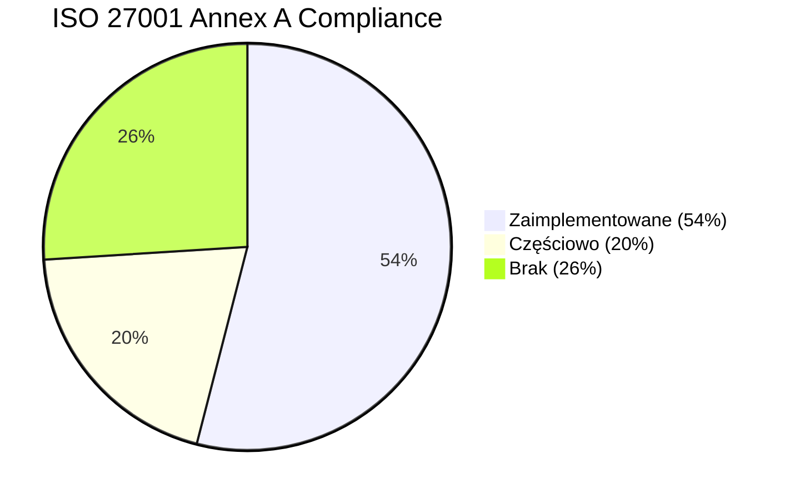
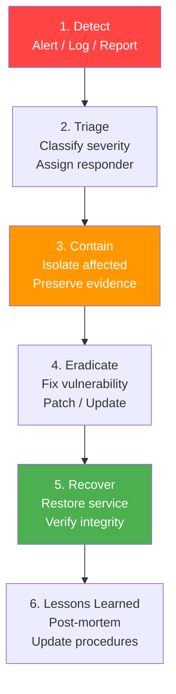

# 04 — Zgodność z ISO 27001

[← Powrót do README](./README.md) | [← Architektura Integracji](./03-integration-architecture.md) | [Następna: Stack Technologiczny →](./05-technology-stack.md)

---

## 📊 Gap Analysis: Obecny Stan

### Obecny poziom zgodności: ~54%

Na podstawie audytu bezpieczeństwa z 17 grudnia 2025 (SECURITY_AUDIT_REPORT.md) i analizy kodu z 6 kwietnia 2026.



### Matryca zgodności kontroli Annex A

| Kontrola | Opis | Status | Gap | Milestone | Priorytet |
|----------|------|--------|-----|-----------|-----------|
| **A.5.1** | Polityki bezpieczeństwa informacji | ⚠️ Częściowo | Brak formalnego dokumentu polityki | M1.4.2 | 🟡 |
| **A.6.1** | Organizacja bezpieczeństwa | ⚠️ Częściowo | Brak przypisanych ról security | M1.4.2 | 🟡 |
| **A.8.1** | Zarządzanie aktywami | ✅ OK | Inventory w docker-compose | — | ✅ |
| **A.9.1** | Wymagania biznesowe dla kontroli dostępu | ❌ Brak | Brak polityki dostępu | M1.4.2 | 🔴 |
| **A.9.2.1** | Rejestracja/wyrejestrowanie użytkowników | ❌ **Brak** | **Brak autentykacji /admin** | M1.4.2 | 🔴 **CRITICAL** |
| **A.9.2.2** | Przydzielanie dostępu | ❌ **Brak** | **Brak RBAC** | M1.4.2 | 🔴 **CRITICAL** |
| **A.9.2.3** | Zarządzanie uprzywilejowanym dostępem | ❌ Brak | Brak rozróżnienia admin/operator | M1.4.2 | 🔴 |
| **A.9.4.1** | Ograniczenie dostępu do informacji | ❌ **Brak** | **/admin publicznie dostępny** | M1.4.2 | 🔴 **CRITICAL** |
| **A.9.4.2** | Bezpieczne procedury logowania | ❌ Brak | Brak login flow | M1.4.2 | 🔴 |
| **A.10.1.1** | Polityka kryptografii | ⚠️ Częściowo | DB/Redis bez szyfrowania | M1.4.2 | 🟡 |
| **A.10.1.2** | Zarządzanie kluczami | ⚠️ Częściowo | SECRET_KEY enforced, brak rotation | M1.4.2 | 🟡 |
| **A.12.1.4** | Separacja środowisk | ✅ OK | Docker containers | — | ✅ |
| **A.12.4.1** | Logowanie zdarzeń | ⚠️ Częściowo | AuditLog istnieje, niespójne użycie | M1.4.2 | 🟠 |
| **A.12.4.3** | Logi administratora | ❌ **Brak** | **Brak dedicated admin audit** | M1.4.2 | 🟠 |
| **A.12.4.4** | Synchronizacja zegarów | ✅ OK | UTC timestamps, NTP w Docker | — | ✅ |
| **A.12.6.1** | Zarządzanie podatnościami | ✅ OK | Dependabot, audit complete | — | ✅ |
| **A.13.1.1** | Kontrole sieci | ✅ OK | Nginx, Docker network isolation | — | ✅ |
| **A.13.2.3** | Szyfrowanie transmisji | ✅ OK | TLS 1.2+, HSTS, HTTP/2 | — | ✅ |
| **A.14.1.2** | Zabezpieczanie usług w sieciach | ⚠️ Częściowo | **CSRF brak**, security headers OK | M1.4.2 | 🔴 |
| **A.14.2.1** | Polityka bezpiecznego rozwoju | ✅ OK | Security audit, code review | — | ✅ |
| **A.14.2.5** | Zasady bezpiecznej inżynierii | ⚠️ Częściowo | Input validation OK, CSRF brak | M1.4.2 | 🟠 |
| **A.18.1.3** | Ochrona zapisów | ✅ OK | Audit log, backup procedures | — | ✅ |

### Podsumowanie gap analysis

```
🔴 CRITICAL (blokujące certyfikację):
   3 kontrole — A.9.2.1, A.9.4.1, A.14.1.2

🟠 HIGH (wymagane do certyfikacji):
   3 kontrole — A.12.4.1, A.12.4.3, A.14.2.5

🟡 MEDIUM (rekomendowane):
   4 kontrole — A.5.1, A.6.1, A.10.1.1, A.10.1.2

✅ OK (spełnione):
   11 kontroli — poprawnie zaimplementowane

Docelowo: 100% (21/21 kontroli)
```

---

## 🔐 Authentication & Authorization

### Architektura Auth (M1.4.2)

```mermaid
graph TB
    subgraph "Klient"
        BROWSER[Web Browser]
        APIC[API Client]
    end
    
    subgraph "Auth Layer"
        LOGIN[Login Endpoint<br/>/auth/login]
        SESSION[Session Store<br/>Redis-backed]
        JWT_V[JWT Validator<br/>Bearer Token]
        RBAC[RBAC Engine<br/>Role Check]
    end
    
    subgraph "Protected Routes"
        ADMIN[/admin/*<br/>role: admin]
        OPS[/api/sync/*<br/>role: operator+]
        PUBLIC[/api/v1/indicators<br/>role: viewer+]
        HEALTH[/healthz<br/>no auth]
    end
    
    BROWSER -->|Cookie + CSRF| LOGIN
    LOGIN --> SESSION
    SESSION --> RBAC
    
    APIC -->|Bearer JWT| JWT_V
    JWT_V --> RBAC
    
    RBAC -->|admin| ADMIN
    RBAC -->|operator| OPS
    RBAC -->|viewer| PUBLIC
    
    HEALTH -.->|no auth| HEALTH
    
    style LOGIN fill:#ff4444,color:#fff
    style RBAC fill:#ff4444,color:#fff
```

### Role-Based Access Control (RBAC)

| Rola | Opis | Uprawnienia |
|------|------|------------|
| **admin** | Administrator systemu | Pełny dostęp: config, users, feeds, export, audit |
| **operator** | Operator SOC | Zarządzanie feedami, sync, export, podgląd logów |
| **viewer** | Analityk / Read-only | Wyszukiwanie IOC, eksport danych, podgląd dashboards |
| **api_service** | Konto serwisowe (M2M) | Export API, indicators API (bez UI) |

### Mapowanie uprawnień

```python
"""
app/auth/permissions.py — Definicja uprawnień per rola.
"""

from enum import Flag, auto


class Permission(Flag):
    """Granularne uprawnienia."""
    # Indicators
    INDICATORS_READ = auto()
    INDICATORS_EXPORT = auto()
    
    # Feeds
    FEEDS_VIEW = auto()
    FEEDS_CONFIGURE = auto()
    FEEDS_SYNC = auto()
    
    # Admin
    ADMIN_SETTINGS = auto()
    ADMIN_USERS = auto()
    ADMIN_AUDIT = auto()
    
    # System
    SYSTEM_HEALTH = auto()
    SYSTEM_METRICS = auto()


# Role → Permission mapping
ROLE_PERMISSIONS = {
    "admin": (
        Permission.INDICATORS_READ | Permission.INDICATORS_EXPORT |
        Permission.FEEDS_VIEW | Permission.FEEDS_CONFIGURE | Permission.FEEDS_SYNC |
        Permission.ADMIN_SETTINGS | Permission.ADMIN_USERS | Permission.ADMIN_AUDIT |
        Permission.SYSTEM_HEALTH | Permission.SYSTEM_METRICS
    ),
    "operator": (
        Permission.INDICATORS_READ | Permission.INDICATORS_EXPORT |
        Permission.FEEDS_VIEW | Permission.FEEDS_CONFIGURE | Permission.FEEDS_SYNC |
        Permission.SYSTEM_HEALTH | Permission.SYSTEM_METRICS
    ),
    "viewer": (
        Permission.INDICATORS_READ | Permission.INDICATORS_EXPORT |
        Permission.FEEDS_VIEW |
        Permission.SYSTEM_HEALTH
    ),
    "api_service": (
        Permission.INDICATORS_READ | Permission.INDICATORS_EXPORT |
        Permission.SYSTEM_HEALTH
    ),
}
```

### Implementacja autentykacji

```python
"""
app/auth/middleware.py — Auth middleware dla Flask.
"""

import functools
from flask import request, redirect, session, g, abort

from app.auth.permissions import Permission, ROLE_PERMISSIONS


def login_required(f):
    """Decorator: wymaga zalogowania (session lub JWT)."""
    @functools.wraps(f)
    def decorated(*args, **kwargs):
        # 1. Check session (Web UI)
        if "user_id" in session:
            g.current_user = get_user_from_session(session["user_id"])
            return f(*args, **kwargs)
        
        # 2. Check JWT (API)
        auth_header = request.headers.get("Authorization", "")
        if auth_header.startswith("Bearer "):
            token = auth_header[7:]
            user = validate_jwt(token)
            if user:
                g.current_user = user
                return f(*args, **kwargs)
        
        # 3. Not authenticated
        if request.is_json or request.path.startswith("/api/"):
            abort(401, description="Authentication required")
        return redirect("/auth/login")
    
    return decorated


def require_permission(permission: Permission):
    """Decorator: wymaga konkretnego uprawnienia."""
    def decorator(f):
        @functools.wraps(f)
        @login_required
        def decorated(*args, **kwargs):
            user = g.current_user
            role_perms = ROLE_PERMISSIONS.get(user.role, Permission(0))
            
            if not (role_perms & permission):
                abort(403, description=f"Insufficient permissions: {permission.name}")
            
            return f(*args, **kwargs)
        return decorated
    return decorator


# Użycie:
@app.route("/admin/settings", methods=["GET", "POST"])
@require_permission(Permission.ADMIN_SETTINGS)
def admin_settings():
    """Chroniony endpoint — wymaga roli admin."""
    ...

@app.route("/api/v1/indicators")
@require_permission(Permission.INDICATORS_READ)
def api_indicators():
    """API endpoint — wymaga minimum roli viewer."""
    ...
```

---

## 📋 CSRF Protection

### Implementacja

```python
"""
app/auth/csrf.py — CSRF protection dla Flask.
"""

import secrets
import hmac
from flask import request, session, abort

CSRF_TOKEN_LENGTH = 64
CSRF_HEADER_NAME = "X-CSRF-Token"
CSRF_FORM_FIELD = "csrf_token"


def generate_csrf_token() -> str:
    """Generuj nowy CSRF token i zapisz w session."""
    token = secrets.token_hex(CSRF_TOKEN_LENGTH)
    session["csrf_token"] = token
    return token


def validate_csrf_token():
    """
    Waliduj CSRF token dla state-changing requests.
    Token musi być w header LUB form field.
    """
    if request.method in ("GET", "HEAD", "OPTIONS"):
        return  # Safe methods don't need CSRF
    
    expected = session.get("csrf_token")
    if not expected:
        abort(403, description="CSRF session expired")
    
    # Check header first (API/AJAX), then form field
    provided = (
        request.headers.get(CSRF_HEADER_NAME)
        or request.form.get(CSRF_FORM_FIELD)
    )
    
    if not provided or not hmac.compare_digest(provided, expected):
        abort(403, description="CSRF token invalid")


# Register as before_request hook
@app.before_request
def csrf_protect():
    """Apply CSRF protection to admin routes."""
    if request.path.startswith("/admin") or request.path.startswith("/api/sync"):
        validate_csrf_token()
```

---

## 📝 Audit Logging

### Co logujemy (WHO, WHAT, WHEN, WHERE, RESULT)

```python
"""
app/audit/logger.py — Comprehensive audit logging.
ISO 27001 A.12.4.1, A.12.4.3 compliant.
"""

from datetime import datetime, timezone
from typing import Optional, Any, Dict

from sqlalchemy.orm import Session
from app.models import AuditLog


class AuditLogger:
    """
    Standardized audit logging.
    
    Captures:
    - WHO: user_id, user_role, ip_address, user_agent
    - WHAT: action, entity_type, entity_id, changes
    - WHEN: timestamp (UTC), timezone
    - WHERE: method, endpoint, correlation_id
    - RESULT: status (success/failure), error_message
    """
    
    def __init__(self, db: Session):
        self.db = db
    
    def log(
        self,
        action: str,
        *,
        entity_type: Optional[str] = None,
        entity_id: Optional[int] = None,
        user_id: Optional[str] = None,
        user_role: Optional[str] = None,
        ip_address: Optional[str] = None,
        user_agent: Optional[str] = None,
        method: Optional[str] = None,
        endpoint: Optional[str] = None,
        status: str = "success",
        error_message: Optional[str] = None,
        changes: Optional[Dict[str, Any]] = None,
        metadata: Optional[Dict[str, Any]] = None,
        correlation_id: Optional[str] = None,
    ) -> None:
        """Log audit event."""
        entry = AuditLog(
            action=action,
            entity_type=entity_type,
            entity_id=entity_id,
            user_id=user_id or "system",
            ip_address=ip_address,
            metadata={
                "user_role": user_role,
                "user_agent": user_agent,
                "method": method,
                "endpoint": endpoint,
                "status": status,
                "error_message": error_message,
                "changes": changes,
                "correlation_id": correlation_id,
                **(metadata or {}),
            },
            created_at=datetime.now(timezone.utc),
        )
        self.db.add(entry)
        self.db.flush()  # Ensure ID assigned


# Zdarzenia wymagające audit:
AUDITABLE_ACTIONS = [
    # Authentication
    "auth.login",
    "auth.logout",
    "auth.login_failed",
    "auth.token_issued",
    "auth.token_revoked",
    
    # User management
    "user.created",
    "user.updated",
    "user.deleted",
    "user.role_changed",
    
    # Feed management
    "feed.configured",
    "feed.enabled",
    "feed.disabled",
    "feed.sync_triggered",
    "feed.sync_completed",
    "feed.sync_failed",
    
    # Settings
    "settings.updated",
    "settings.secret_changed",
    
    # Export
    "export.requested",
    "export.completed",
    "export.large_export",  # >10k records
    
    # System
    "system.startup",
    "system.shutdown",
    "system.config_reload",
    "system.migration_run",
]
```

---

## 🔒 Data Encryption

### At Rest

| Zasób | Obecny stan | Docelowy | Priorytet |
|-------|-------------|----------|-----------|
| PostgreSQL data | ❌ Nieszyfrowane | ✅ PostgreSQL TDE lub LUKS volume | 🟡 Medium |
| Redis data | ❌ Nieszyfrowane | ✅ Redis TLS mode | 🟡 Medium |
| Secrets w AppSettings | ✅ AES-GCM | ✅ AES-GCM (zachować) | ✅ OK |
| Backup files | ❌ Nieszyfrowane | ✅ GPG encrypted backups | 🟡 Medium |
| Docker volumes | ❌ Nieszyfrowane | ✅ LUKS encrypted volumes | 🟢 Low |

### In Transit

| Połączenie | Obecny stan | Docelowy | Priorytet |
|------------|-------------|----------|-----------|
| Client → Nginx | ✅ TLS 1.2+ | ✅ TLS 1.3 | 🟢 Low |
| Nginx → Flask | ⚠️ HTTP (localhost) | ✅ mTLS (optional) | 🟢 Low |
| Flask → PostgreSQL | ⚠️ Nieszyfrowane (localhost) | ✅ TLS dla remote replicas | 🟡 Medium |
| Flask → Redis | ⚠️ Nieszyfrowane (localhost) | ✅ Redis TLS | 🟡 Medium |
| Worker → External APIs | ✅ HTTPS (SSL verify) | ✅ HTTPS + cert pinning | 🟢 Low |

### Konfiguracja TLS (Nginx)

```nginx
# Docelowa konfiguracja TLS 1.3
ssl_protocols TLSv1.2 TLSv1.3;
ssl_ciphers ECDHE-ECDSA-AES128-GCM-SHA256:ECDHE-RSA-AES128-GCM-SHA256:ECDHE-ECDSA-AES256-GCM-SHA384:ECDHE-RSA-AES256-GCM-SHA384;
ssl_prefer_server_ciphers off;
ssl_session_timeout 1d;
ssl_session_cache shared:SSL:10m;
ssl_session_tickets off;
ssl_stapling on;
ssl_stapling_verify on;
```

---

## 🔑 Secret Management

### Obecny stan vs. docelowy

| Aspekt | Obecny | Docelowy |
|--------|--------|----------|
| Przechowywanie | `.env` file | HashiCorp Vault / K8s Secrets |
| Rotation | ❌ Ręczna | ✅ Automated (Vault lease) |
| Audit | ❌ Brak | ✅ Vault audit log |
| Encryption at rest | ⚠️ AppSettings only | ✅ Wszystkie secrets |
| Access control | ❌ Brak (file-based) | ✅ Policy-based (Vault) |

### Strategia migracji (etapowa)

**Etap 1 (M1.4.2):** Docker secrets + ENV validation
```yaml
# docker-compose.yml
services:
  app:
    secrets:
      - db_password
      - secret_key
      - api_keys
    environment:
      SECRET_KEY_FILE: /run/secrets/secret_key
      DB_PASSWORD_FILE: /run/secrets/db_password

secrets:
  db_password:
    file: ./secrets/db_password.txt
  secret_key:
    file: ./secrets/secret_key.txt
```

**Etap 2 (M1.6.0+):** HashiCorp Vault integration
```python
"""
app/config/vault_client.py — Vault integration.
"""

import hvac

class VaultSecretProvider:
    def __init__(self, vault_url: str, token: str):
        self.client = hvac.Client(url=vault_url, token=token)
    
    def get_secret(self, path: str, key: str) -> str:
        """Pobierz secret z Vault."""
        response = self.client.secrets.kv.v2.read_secret_version(path=path)
        return response["data"]["data"][key]
    
    def get_db_credentials(self) -> dict:
        """Pobierz dynamic DB credentials (Vault database engine)."""
        creds = self.client.secrets.database.generate_credentials(name="ioc-db-role")
        return {
            "username": creds["data"]["username"],
            "password": creds["data"]["password"],
            "ttl": creds["lease_duration"],
        }
```

---

## 🚨 Incident Response Procedures

### Klasyfikacja incydentów

| Severity | Opis | Response Time | Przykłady |
|----------|------|---------------|-----------|
| **P1 Critical** | Data breach, system compromise | <15 min | Unauthorized admin access, data exfiltration |
| **P2 High** | Service disruption, vulnerability exploit | <1h | All feeds down, SQL injection attempt |
| **P3 Medium** | Partial degradation, failed auth attempts | <4h | Single feed failure, brute force attempt |
| **P4 Low** | Minor issues, informational | <24h | Config drift, audit log gaps |

### Incident Response Playbook



---

## ✅ Compliance Checklist per Milestone

### M1.4.2 — Security Hardening

- [ ] **Authentication**
  - [ ] Login page z rate limiting (5 attempts / 15 min)
  - [ ] Session management (Redis backend, 30 min timeout)
  - [ ] Password hashing (argon2id, min 12 chars)
  - [ ] JWT dla API (RS256, 1h expiry, refresh token)
  - [ ] Logout z session invalidation

- [ ] **Authorization (RBAC)**
  - [ ] 4 role: admin, operator, viewer, api_service
  - [ ] Permission mapping per endpoint
  - [ ] Default deny (whitelist approach)
  - [ ] Role assignment via admin panel

- [ ] **CSRF Protection**
  - [ ] Token generation per session
  - [ ] Validation dla POST/PUT/DELETE
  - [ ] Header (X-CSRF-Token) i form field support
  - [ ] Double-submit cookie pattern (backup)

- [ ] **Audit Logging**
  - [ ] Logowanie WSZYSTKICH auth events
  - [ ] Logowanie admin operations
  - [ ] Logowanie feed configuration changes
  - [ ] Logowanie export requests (>1000 records)
  - [ ] Immutable audit trail (append-only)

- [ ] **Secret Management**
  - [ ] Docker secrets dla sensitive env vars
  - [ ] SECRET_KEY: min 64 chars, fail-fast
  - [ ] API keys: encrypted storage (AppSettings)
  - [ ] No secrets in logs (redaction)

### M1.6.1 — Integration Security

- [ ] **Adapter Security**
  - [ ] API keys w encrypted config (nie hardcoded)
  - [ ] TLS verification enforced (default: True)
  - [ ] Proxy credentials nie w logach
  - [ ] Rate limiting per adapter (prevent abuse)
  - [ ] Input validation na fetched data

- [ ] **Data Integrity**
  - [ ] Checksum verification dla fetched data
  - [ ] Schema validation dla CanonicalIOC
  - [ ] Immutable DTOs (frozen dataclasses)

---

## 🔧 Security Testing Requirements

### OWASP Top 10 Coverage

| # | Vulnerability | Mitigacja | Status |
|---|--------------|-----------|--------|
| A01 | Broken Access Control | RBAC + route protection | ❌ M1.4.2 |
| A02 | Cryptographic Failures | AES-GCM, TLS 1.3 | ⚠️ Częściowo |
| A03 | Injection | Parameterized queries, input validation | ✅ OK |
| A04 | Insecure Design | Threat modeling, ADR | ⚠️ M1.4.2 |
| A05 | Security Misconfiguration | Security headers, CSP | ✅ OK |
| A06 | Vulnerable Components | Dependabot, weekly updates | ✅ OK |
| A07 | Auth & Identity Failures | Session mgmt, password policy | ❌ M1.4.2 |
| A08 | Data Integrity Failures | Checksum, schema validation | ⚠️ M1.6.1 |
| A09 | Security Logging | Audit trail, alerting | ⚠️ M1.4.2 |
| A10 | SSRF | URL validation, allowlist | ✅ OK |

### Penetration Testing Checklist

- [ ] Authentication bypass attempts
- [ ] Session hijacking / fixation
- [ ] CSRF exploitation
- [ ] SQL injection (all endpoints)
- [ ] XSS (reflected, stored, DOM)
- [ ] API abuse (rate limiting, parameter tampering)
- [ ] File upload vulnerabilities (jeśli dotyczy)
- [ ] Information disclosure (error messages, headers)
- [ ] Privilege escalation (viewer → admin)
- [ ] Business logic flaws (export abuse, feed manipulation)

---

## 📖 GDPR Considerations

IOC Service przetwarza adresy IP, domeny i adresy email, które **mogą** stanowić dane osobowe w kontekście GDPR.

### Wymagania

| Aspekt | Implementacja |
|--------|--------------|
| **Podstawa prawna** | Uzasadniony interes (Art. 6.1.f) — bezpieczeństwo IT |
| **Minimalizacja danych** | Przechowuj tylko IOC values + metadata operacyjne |
| **Okres przechowywania** | TTL-based cleanup (domyślnie 90 dni) |
| **Prawo do usunięcia** | API endpoint `/api/v1/data-subject/erasure` |
| **Dokumentacja** | ROPA (Record of Processing Activities) |

---

[← Architektura Integracji](./03-integration-architecture.md) | [Następna: Stack Technologiczny →](./05-technology-stack.md)
