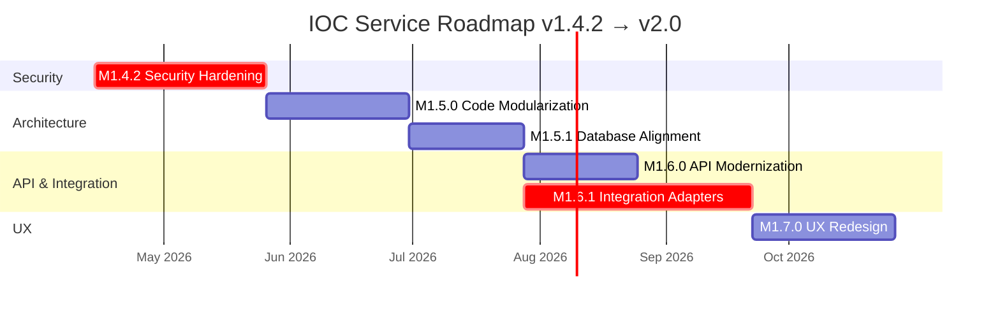

# 06 — Milestones & Roadmap

[← Powrót do README](./README.md) | [← Stack Technologiczny](./05-technology-stack.md) | [Następna: Role Zespołowe →](./07-roles/backend-developer.md)

---

## 📊 Przegląd Roadmap



---

## 🔴 M1.4.2 — Security Hardening

### Cel
Zabezpieczyć panel administracyjny, wdrożyć CSRF protection, ustandaryzować audit logging. **Odblokować zgodność z ISO 27001.**

### Deliverables

| # | Deliverable | Story Points | Priorytet |
|---|-------------|-------------|-----------|
| 1 | Authentication system (login/logout/session) | 8 SP | 🔴 Critical |
| 2 | RBAC engine (4 role, permission mapping) | 5 SP | 🔴 Critical |
| 3 | CSRF protection (token-based) | 5 SP | 🔴 Critical |
| 4 | Comprehensive audit logging | 5 SP | 🟠 High |
| 5 | Secret management (Docker secrets) | 3 SP | 🟠 High |
| 6 | .dockerignore + container hardening | 2 SP | 🟡 Medium |
| 7 | Security tests + penetration test checklist | 3 SP | 🟠 High |
| 8 | Documentation (security policy) | 3 SP | 🟡 Medium |
| **TOTAL** | | **34 SP** | |

### User Stories

**US-142-1: Jako administrator, chcę się zalogować do panelu admin, aby nikt nieupoważniony nie miał dostępu.**
- AC1: Strona `/auth/login` z formularzem username + password
- AC2: Rate limiting: 5 prób / 15 min, lockout po 10 próbach
- AC3: Session timeout: 30 min nieaktywności
- AC4: Bezpieczne cookies (Secure, HttpOnly, SameSite=Lax)
- AC5: Audit log: każde logowanie (success/failure) z IP i timestamp

**US-142-2: Jako operator, chcę mieć dostęp do zarządzania feedami, ale nie do ustawień systemowych.**
- AC1: Rola "operator" ma dostęp do: feeds, sync, export, indicators
- AC2: Rola "operator" NIE ma dostępu do: settings, users, system config
- AC3: Próba dostępu do /admin/settings → HTTP 403
- AC4: UI ukrywa linki do niedostępnych sekcji

**US-142-3: Jako security engineer, chcę widzieć pełny audit trail, aby spełnić wymagania ISO 27001.**
- AC1: Każda zmiana konfiguracji feedu → audit log entry
- AC2: Każdy manual sync trigger → audit log entry
- AC3: Każdy export danych (>1000 records) → audit log entry
- AC4: Filtrowanie audit logów po: użytkowniku, akcji, dacie, entity

### Kroki implementacji

```
Tydzień 1-2: Authentication
├─ 1. Dodaj Flask-Login + Flask-WTF do dependencies
├─ 2. Stwórz model User (id, username, password_hash, role, active, created_at)
├─ 3. Implementuj password hashing (argon2id)
├─ 4. Stwórz login page template (Jinja2)
├─ 5. Implementuj login/logout endpoints
├─ 6. Dodaj session middleware (Redis backend)
├─ 7. Ochrona /admin/* routes (@login_required)
└─ 8. Testy: login flow, session timeout, brute force protection

Tydzień 3: RBAC
├─ 1. Stwórz Permission enum i ROLE_PERMISSIONS mapping
├─ 2. Implementuj @require_permission decorator
├─ 3. Dodaj role do User model
├─ 4. Zaktualizuj UI: ukryj niedostępne elementy per rola
├─ 5. Endpoint do zarządzania użytkownikami (/admin/users)
└─ 6. Testy: permission enforcement, privilege escalation prevention

Tydzień 4: CSRF + Audit
├─ 1. Implementuj CSRF token generation + validation
├─ 2. Dodaj CSRF token do wszystkich formularzy
├─ 3. Rozbuduj AuditLogger (WHO, WHAT, WHEN, WHERE, RESULT)
├─ 4. Dodaj audit hooks do wszystkich admin endpoints
├─ 5. Endpoint /admin/audit z filtrowaniem
└─ 6. Testy: CSRF bypass attempts, audit completeness

Tydzień 5: Hardening + Secrets
├─ 1. Docker secrets integration
├─ 2. .dockerignore (exclude dev files, tests, docs)
├─ 3. Container security (non-root, read-only filesystem)
├─ 4. Secret key rotation procedure
└─ 5. Security regression test suite

Tydzień 6: Documentation + Testing
├─ 1. Security policy document
├─ 2. Penetration testing checklist execution
├─ 3. Integration tests z full auth flow
├─ 4. Code review + merge
└─ 5. Deployment verification
```

### Definition of Done
- ✅ Admin panel wymaga autentykacji (login page)
- ✅ 4 role RBAC: admin, operator, viewer, api_service
- ✅ CSRF tokens chronią POST/PUT/DELETE
- ✅ Audit trail dla wszystkich admin operations
- ✅ Docker secrets dla sensitive env vars
- ✅ .dockerignore minimalizuje build context
- ✅ 0 failing security tests
- ✅ Penetration test checklist: 0 critical/high findings

### Rollback Plan
1. Feature flag: `ENABLE_AUTH=true|false` — przy `false` powrót do obecnego stanu
2. Database migration: `alembic downgrade` usuwa tabelę users
3. Czas rollback: <15 min

---

## 🟠 M1.5.0 — Code Modularization

### Cel
Rozbić God Objects (`app/main.py`: 2,555 LOC, `app/routes/ops.py`: 1,529 LOC) na małe, testowalne moduły. Wprowadzić Service Layer.

### Deliverables

| # | Deliverable | Story Points |
|---|-------------|-------------|
| 1 | Split `app/main.py` → app factory (<500 LOC) | 8 SP |
| 2 | Split `app/routes/ops.py` → admin.py + sync.py + settings.py | 8 SP |
| 3 | Extract inline HTML → Jinja templates | 8 SP |
| 4 | Introduce Service Layer (IndicatorService, FeedService) | 8 SP |
| 5 | Regression tests for module boundaries | 5 SP |
| 6 | Architecture Decision Records (ADR) | 3 SP |
| **TOTAL** | | **40 SP** |

### Kroki implementacji

```
Tydzień 1-2: Split main.py
├─ 1. Zidentyfikuj grupy odpowiedzialności w main.py
├─ 2. Wydziel: app/factory.py (create_app, <500 LOC)
├─ 3. Wydziel: app/services/indicator_service.py
├─ 4. Wydziel: app/services/feed_service.py
├─ 5. Wydziel: app/services/export_service.py
├─ 6. Przenieś inline HTML → templates/
├─ 7. Testy regresji: sprawdź że wszystkie endpointy działają
└─ 8. Code review

Tydzień 3-4: Split ops.py + Service Layer
├─ 1. ops.py → routes/admin.py (Admin UI)
├─ 2. ops.py → routes/sync_jobs.py (Sync API)
├─ 3. ops.py → routes/settings.py (Settings management)
├─ 4. Routes delegują do Services (nie bezpośrednio DB)
├─ 5. Dependency injection via Flask g object
├─ 6. Unit tests dla każdego Service
└─ 7. Integration tests dla module boundaries

Tydzień 5: Cleanup + Documentation
├─ 1. Usuń dead code
├─ 2. Dodaj type hints do nowych modułów
├─ 3. Zaktualizuj imports w testach
├─ 4. ADR-007: Service Layer Architecture
└─ 5. Final review + merge
```

### Definition of Done
- ✅ `app/main.py` (lub `app/factory.py`) zawiera TYLKO wiring logic (<500 LOC)
- ✅ Brak inline HTML w route/business modules
- ✅ Route handlers delegują do typed services
- ✅ Każdy nowy moduł ma >80% test coverage
- ✅ Zero regression (all existing tests pass)

---

## 🟡 M1.5.1 — Database Schema Alignment

### Cel
Wybrać single source of truth dla schema (Alembic), wyeliminować dual schema management, dodać PostgreSQL-specific integration tests.

### Deliverables

| # | Deliverable | Story Points |
|---|-------------|-------------|
| 1 | Alembic jako jedyne źródło prawdy | 5 SP |
| 2 | Migracja database/init/*.sql → Alembic | 5 SP |
| 3 | Dodanie brakujących FK constraints | 3 SP |
| 4 | PostgreSQL integration tests (JSONB, FTS, triggers) | 8 SP |
| 5 | Schema drift detection w CI | 3 SP |
| 6 | Remove hardcoded export limits | 2 SP |
| **TOTAL** | | **26 SP** |

### Kroki implementacji

```
Tydzień 1-2: Migracja Schema
├─ 1. Audit: porównaj database/init/*.sql vs app/models.py
├─ 2. Stwórz comprehensive Alembic migration (initial)
├─ 3. Dodaj brakujące FK: sync_jobs → feeds, feed_runs → feeds
├─ 4. Przenieś triggers do Alembic migrations
├─ 5. Przenieś views i functions do Alembic
├─ 6. Oznacz database/init/*.sql jako DEPRECATED
└─ 7. Test: fresh install via Alembic produces same schema

Tydzień 3-4: Integration Tests + CI
├─ 1. PostgreSQL test container (pytest-postgresql lub testcontainers)
├─ 2. Test triggers (updated_at auto-update)
├─ 3. Test views (v_feed_summary correctness)
├─ 4. Test JSONB queries (GIN index usage)
├─ 5. Test FTS (pg_trgm trigram search)
├─ 6. Schema drift detection script (compare ORM ↔ DB)
├─ 7. CI pipeline: run schema drift check on every PR
└─ 8. Remove hardcoded export limits → runtime config
```

### Definition of Done
- ✅ Alembic jest jedynym źródłem prawdy dla schema
- ✅ `database/init/*.sql` oznaczone jako deprecated
- ✅ Fresh install via `alembic upgrade head` daje poprawny schemat
- ✅ PostgreSQL-specific features (triggers, views, FTS) testowane w CI
- ✅ Automated schema drift detection w CI pipeline
- ✅ Wszystkie FK constraints na miejscu

---

## 🟢 M1.6.0 — API Modernization & Configuration Cleanup

### Cel
Ustabilizować publiczny kontrakt systemu przez wersjonowane API, OpenAPI specification i uporządkowanie konfiguracji oraz zależności projektu.

### Deliverables

| # | Deliverable | Story Points |
|---|-------------|-------------|
| 1 | `/api/v1` route namespace + backward compatibility plan | 5 SP |
| 2 | OpenAPI specification + Swagger/Redoc publication | 5 SP |
| 3 | Config split into typed sections (database/security/feeds/runtime) | 5 SP |
| 4 | Remove duplicated env parsing outside config layer | 3 SP |
| 5 | Migrate project metadata toward `pyproject.toml` | 5 SP |
| 6 | Split prod/dev dependencies and define migration notes for clients | 3 SP |
| **TOTAL** | | **26 SP** |

### Kroki implementacji

```
Tydzień 1: API surface
├─ 1. Zdefiniuj docelowe `/api/v1/*` endpointy i mapowanie starych tras
├─ 2. Dodaj compatibility layer / redirects / aliases dla obecnych klientów
├─ 3. Ujednolić response envelope, błędy i pagination
└─ 4. Testy kontraktu dla publicznych endpointów

Tydzień 2: OpenAPI + docs
├─ 1. Wybierz bibliotekę OpenAPI (np. Flask-RESTX lub równoważną)
├─ 2. Opisz endpointy, auth schemes i modele odpowiedzi
├─ 3. Opublikuj spec jako artefakt wersjonowany z kodem
└─ 4. Zaktualizuj docs/api.md i appendix API

Tydzień 3-4: Config + packaging
├─ 1. Rozbij Config na sekcje domenowe
├─ 2. Usuń bezpośredni odczyt env z pobocznych modułów
├─ 3. Przenieś metadata projektu do `pyproject.toml`
├─ 4. Rozdziel dependency groups: prod vs dev
├─ 5. Zaktualizuj CI, bootstrap i instrukcje developerskie
└─ 6. Opisz ścieżkę migracji dla klientów starego API
```

### Definition of Done
- ✅ `/api/v1` jest oficjalnym kontraktem publicznym
- ✅ OpenAPI specification jest publikowana i utrzymywana z implementacją
- ✅ konfiguracja ma jedno źródło prawdy i logiczne grupowanie
- ✅ project metadata/dependencies są zarządzane nowocześniej niż przez płaski `requirements.txt`
- ✅ istnieje jawny plan kompatybilności i migracji dla istniejących klientów

---

## 🔵 M1.6.1 — Integration Adapters 🎯 KLUCZOWY MILESTONE

### Cel
Wdrożyć FeedAdapter Protocol, Adapter Registry, Ingestion Pipeline. **Zredukować czas dodania nowej integracji z 2 tygodni do 2 dni.**

### Deliverables

| # | Deliverable | Story Points |
|---|-------------|-------------|
| 1 | FeedAdapter Protocol + contracts (DTOs) | 5 SP |
| 2 | BaseFeedAdapter (shared implementation) | 5 SP |
| 3 | FeedAdapterRegistry (auto-discovery) | 5 SP |
| 4 | IngestionPipeline (shared normalize/dedup/persist) | 8 SP |
| 5 | Migracja CrowdSec → CrowdSecAdapter | 3 SP |
| 6 | Migracja MISP → MISPAdapter | 5 SP |
| 7 | Migracja MWDB → MWDBAdapter | 5 SP |
| 8 | Migracja MalwareBazaar → MalwareBazaarAdapter | 3 SP |
| 9 | Migracja abuse.ch → AbuseCHAdapter (5 sub-services) | 8 SP |
| 10 | Worker v2 (registry-driven scheduling) | 5 SP |
| 11 | Feed config YAML + loader | 3 SP |
| 12 | Contract tests (automatic per adapter) | 3 SP |
| 13 | Adapter template + documentation | 2 SP |
| 14 | Prometheus metrics per adapter | 2 SP |
| **TOTAL** | | **62 SP** |

> Szczegółowa architektura: [03-integration-architecture.md](./03-integration-architecture.md)

### Kroki implementacji

```
Tydzień 1-2: Foundation
├─ 1. Stwórz app/adapters/ package
├─ 2. Implementuj contracts.py (Protocol, DTOs, Value Objects)
├─ 3. Implementuj base.py (BaseFeedAdapter)
├─ 4. Implementuj registry.py (FeedAdapterRegistry)
├─ 5. Implementuj pipeline/ingestion.py (IngestionPipeline)
├─ 6. Contract tests (test_contract.py)
├─ 7. Pipeline unit tests
└─ 8. Code review: foundation

Tydzień 3-4: Migracja prostszych adapterów
├─ 1. CrowdSecAdapter (najprostszy, wzorzec)
├─ 2. MalwareBazaarAdapter 
├─ 3. Parallel run: stary connector + nowy adapter
├─ 4. Porównanie wyników (data parity check)
├─ 5. Unit tests per adapter
└─ 6. Usunięcie starych connectorów (jeśli parity OK)

Tydzień 5-6: Migracja złożonych adapterów
├─ 1. MISPAdapter (PyMISP wrapper)
├─ 2. MWDBAdapter (672 LOC → adapter + shared pipeline)
├─ 3. AbuseCHAdapter (5 sub-services → 1 adapter z sub-feeds)
├─ 4. Parallel run + parity check
├─ 5. Integration tests (adapter + pipeline + DB)
└─ 6. Performance comparison (stary vs nowy)

Tydzień 7-8: Worker v2 + Config + Polish
├─ 1. APScheduler integration
├─ 2. Feed config YAML loader
├─ 3. Worker v2: registry-driven scheduling
├─ 4. Hot-reload config endpoint
├─ 5. Adapter template (_template.py)
├─ 6. Prometheus metrics per adapter
├─ 7. Documentation: how to add new adapter
├─ 8. End-to-end test: add fake adapter, configure, sync
└─ 9. Final cleanup: remove old service/*.py connectors
```

### Definition of Done
- ✅ FeedAdapter Protocol zdefiniowany i udokumentowany
- ✅ 5 istniejących connectorów zmigrowanych na adapter pattern
- ✅ Data parity: identyczne wyniki stary vs nowy (100% match)
- ✅ Contract tests pass dla KAŻDEGO adaptera
- ✅ Worker v2 driven by registry (nie hardcoded)
- ✅ Feed config w YAML (deklaratywny)
- ✅ Adapter template + dokumentacja "How to Add New Adapter"
- ✅ Time to add new adapter: <2 dni (zweryfikowane na fake adapter)
- ✅ Old connectors removed (no dead code)

### Rollback Plan
1. Feature flag: `USE_ADAPTER_PATTERN=true|false`
2. Przy `false`: worker v1 z old connectors
3. Parallel run: oba systemy działają jednocześnie, porównanie wyników
4. Czas rollback: zmiana env var + restart (<5 min)

### Ryzyka specyficzne

| Ryzyko | Prawdopodobieństwo | Impact | Mitigation |
|--------|-------------------|--------|------------|
| Data parity failure | Średnie | 🔴 High | Parallel run z automatycznym porównaniem |
| Performance regression | Niskie | 🟡 Medium | Benchmarki przed i po migracji |
| MWDB complexity | Średnie | 🟡 Medium | Dedykowany sprint na MWDB adapter |
| abuse.ch 5 sub-services | Średnie | 🟡 Medium | Sub-feed pattern w jednym adapterze |

---

## 🟣 M1.7.0 — UX/UI Redesign

### Cel
Przeprojektować UI z tech-centric na workflow-centric. Rozdzielić admin/debug od business UI.

### Deliverables

| # | Deliverable | Story Points |
|---|-------------|-------------|
| 1 | User research: top 3 workflows | 3 SP |
| 2 | Wireframes i prototypy (Figma/ASCII) | 5 SP |
| 3 | Dashboard redesign (KPI, status, alerts) | 8 SP |
| 4 | IOC search redesign (faceted search, saved queries) | 8 SP |
| 5 | Admin panel separation | 5 SP |
| 6 | Responsive design (tablet support) | 5 SP |
| 7 | Accessibility (WCAG 2.1 AA) | 3 SP |
| **TOTAL** | | **37 SP** |

### Top 3 User Workflows

1. **Workflow A: Search & Export IOC** — Analityk wyszukuje IOC po wartości/tagu, filtruje, eksportuje do SIEM
2. **Workflow B: Feed Health Check** — Operator sprawdza status feedów, widzi errory, triggeruje manual sync
3. **Workflow C: New Feed Configuration** — Admin konfiguruje nowe źródło, testuje połączenie, aktywuje

### Definition of Done
- ✅ UI wspiera 3 główne workflows bez "operator knowledge"
- ✅ Admin/debug UI oddzielone od business UI
- ✅ Dashboard: KPI widoczne "at a glance"
- ✅ Responsive: tablet (1024px) i desktop (1920px)
- ✅ WCAG 2.1 AA: contrast, keyboard navigation, screen reader

---

## 📊 Podsumowanie Effort

| Milestone | Story Points | Duration (est.) | Dependencies |
|-----------|-------------|-----------------|--------------|
| M1.4.2 Security | 34 SP | 4-6 tygodni | Brak (start) |
| M1.5.0 Modularization | 40 SP | 4-5 tygodni | M1.4.2 |
| M1.5.1 Database | 26 SP | 3-4 tygodnie | M1.5.0 |
| M1.6.0 API | 30 SP | 3-4 tygodnie | M1.5.1 |
| **M1.6.1 Adapters 🎯** | **62 SP** | **6-8 tygodni** | **M1.5.1** |
| M1.7.0 UX | 37 SP | 4-5 tygodni | M1.6.1 |
| **TOTAL** | **~229 SP** | **~30 tygodni** | |

---

[← Stack Technologiczny](./05-technology-stack.md) | [Następna: Role Zespołowe →](./07-roles/backend-developer.md)
