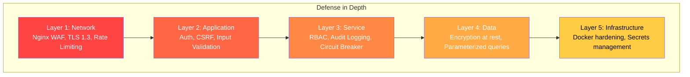

# 07 — Security Engineer

[← Powrót do README](../README.md) | [← DevOps Engineer](./devops-engineer.md) | [Następna: QA Engineer →](./qa-engineer.md)

---

## 🎯 Zakres odpowiedzialności

- Security architecture i threat modeling
- Penetration testing (OWASP methodology)
- ISO 27001 compliance validation
- Vulnerability management (scanning, patching)
- Incident response procedures
- Security monitoring i SIEM integration
- Security training dla zespołu

---

## 🛡️ Security Architecture Overview



---

## 🔍 Threat Modeling (STRIDE)

### Zakres: IOC Service v2.0

| Threat | Kategoria STRIDE | Przykład | Mitigation | Status |
|--------|-----------------|---------|-------------|--------|
| **T1** | **S**poofing | Fałszywy login do /admin | Authentication + rate limiting | ❌ M1.4.2 |
| **T2** | **T**ampering | Modyfikacja feed config | CSRF + RBAC + audit log | ❌ M1.4.2 |
| **T3** | **R**epudiation | Admin zaprzecza zmianom | Comprehensive audit trail | ❌ M1.4.2 |
| **T4** | **I**nformation Disclosure | Wyciek API keys | Encrypted secrets, no logs | ✅ OK |
| **T5** | **D**enial of Service | Flood API requests | Rate limiting (nginx + app) | ✅ OK |
| **T6** | **E**levation of Privilege | Viewer → admin | RBAC enforcement | ❌ M1.4.2 |
| **T7** | Tampering | Poisoned threat feed | Data validation + confidence scoring | ⚠️ M1.6.1 |
| **T8** | Information Disclosure | SQL injection | Parameterized queries | ✅ OK |
| **T9** | Spoofing | Forged X-Forwarded-For | Trusted proxy count | ✅ Fixed |
| **T10** | Tampering | MITM on feed fetch | TLS verification enforced | ✅ OK |

---

## 🧪 Penetration Testing Checklist (OWASP)

### Authentication Testing

- [ ] Brute force login (rate limiting verification)
- [ ] Default credentials test
- [ ] Session fixation
- [ ] Session hijacking (cookie theft)
- [ ] JWT token manipulation (alg=none, key confusion)
- [ ] Password reset flow (if implemented)
- [ ] Account lockout mechanism
- [ ] Concurrent session handling

### Authorization Testing

- [ ] Horizontal privilege escalation (user A → user B data)
- [ ] Vertical privilege escalation (viewer → admin)
- [ ] IDOR (Insecure Direct Object Reference)
- [ ] Force browsing (/admin/* without auth)
- [ ] API endpoint access without proper role
- [ ] CORS misconfiguration

### Input Validation

- [ ] SQL injection (all query parameters)
- [ ] XSS (reflected, stored, DOM-based)
- [ ] Command injection (if any shell calls)
- [ ] Path traversal
- [ ] SSRF (Server-Side Request Forgery)
- [ ] XXE (XML External Entity) — XML export format
- [ ] Template injection (Jinja2)

### Business Logic

- [ ] Feed data poisoning (malicious IOC injection)
- [ ] Export abuse (massive data exfiltration)
- [ ] Rate limit bypass
- [ ] Sync job manipulation
- [ ] Configuration tampering

---

## 📊 Security Controls Implementation

### Kontrole wg ISO 27001 Annex A

Szczegóły: [04-iso27001-compliance.md](../04-iso27001-compliance.md)

**Twoje kluczowe deliverables:**

1. **M1.4.2:** Review i validation implementacji auth/CSRF/audit
2. **M1.4.2:** Penetration test po wdrożeniu security hardening
3. **M1.6.1:** Security review adapter pattern (data validation, TLS)
4. **Ciągłe:** Vulnerability scanning (Dependabot, Trivy, Bandit)
5. **Ciągłe:** Security monitoring configuration (alert rules)

---

## 🔒 Vulnerability Management

### Scanning Pipeline

```
┌────────────┐    ┌────────────┐    ┌────────────┐
│  Bandit     │    │  Safety     │    │  Trivy      │
│  (SAST)     │    │  (Deps)     │    │  (Container)│
└──────┬─────┘    └──────┬─────┘    └──────┬─────┘
       │                 │                 │
       └─────────┬─────┴─────────┘
                 │
           ┌────┴────┐
           │ CI Gate  │  ← Block merge on critical/high
           └────┬────┘
                │
           ┌────┴────┐
           │ Report   │  ← Dashboard z wynikami
           └─────────┘
```

### Patching SLA

| Severity | SLA | Przykład |
|----------|-----|----------|
| Critical (CVSS 9.0+) | <24h | RCE, auth bypass |
| High (CVSS 7.0-8.9) | <7 dni | SQLi, XSS stored |
| Medium (CVSS 4.0-6.9) | <30 dni | Information disclosure |
| Low (CVSS <4.0) | Next release | Cosmetic, minor |

---

## 🚨 Incident Response Playbooks

### Playbook 1: Unauthorized Admin Access

```
1. DETECT: Alert from failed login attempts / unusual admin session
2. CONTAIN:
   - Disable compromised account immediately
   - Rotate SECRET_KEY
   - Invalidate all sessions (Redis flush)
3. INVESTIGATE:
   - Review audit logs (who, when, from where)
   - Check for data exfiltration (large exports)
   - Check for config changes (feed modifications)
4. ERADICATE:
   - Patch vulnerability (if code issue)
   - Strengthen auth (MFA if applicable)
5. RECOVER:
   - Re-enable accounts with new passwords
   - Verify data integrity (compare with backup)
6. LESSONS:
   - Post-mortem document
   - Update monitoring rules
```

### Playbook 2: Feed Data Poisoning

```
1. DETECT: Unusual spike in IOC count, suspicious indicators
2. CONTAIN:
   - Disable affected feed
   - Quarantine ingested data (mark as suspicious)
3. INVESTIGATE:
   - Compare with baseline data
   - Check source feed integrity
   - Verify confidence scores
4. ERADICATE:
   - Remove poisoned indicators
   - Add validation rules for detected pattern
5. RECOVER:
   - Re-sync from clean source
   - Notify downstream consumers
6. LESSONS:
   - Strengthen data validation pipeline
   - Add anomaly detection alerts
```

---

## 📖 Security Training Requirements

| Temat | Dla kogo | Częstotliwość |
|-------|----------|---------------|
| OWASP Top 10 | Wszyscy developerzy | Rocznie |
| Secure coding (Python) | Backend developers | Co 6 miesięcy |
| Threat modeling | Tech leads, architects | Przy nowych features |
| Incident response | Cały zespół | Rocznie (+ drill) |
| Social engineering | Cały zespół | Rocznie |

---

[← DevOps Engineer](./devops-engineer.md) | [Następna: QA Engineer →](./qa-engineer.md)
