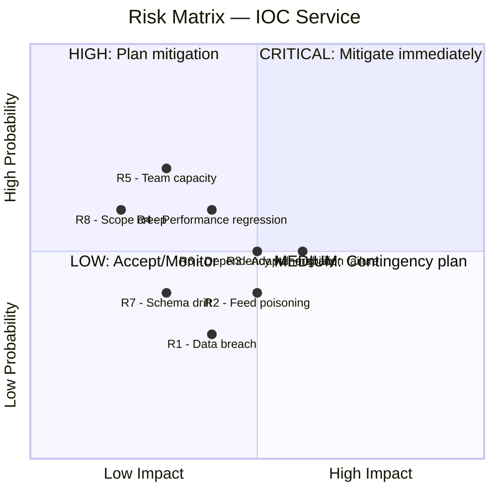

# 10 — Zarządzanie Ryzykiem

[← Powrót do README](./README.md) | [← Metryki Jakości](./09-quality-metrics.md) | [Następna: Załączniki →](./11-appendices/glossary.md)

---

## 🎯 Risk Matrix

---

## 📝 Zidentyfikowane Ryzyka

### R1: Data Breach (Unauthorized Access) 🔴

| Aspekt | Opis |
|--------|------|
| **Kategoria** | Security |
| **Prawdopodobieństwo** | Średnie (admin panel publiczny) |
| **Impact** | 🔴 Critical (dane IOC, API keys, reputacja) |
| **Trigger** | Brak authentication na /admin |
| **Mitigation** | M1.4.2: Auth + RBAC + CSRF + Audit |
| **Contingency** | Incident response playbook, backup restore |
| **Owner** | Security Engineer |
| **Status** | ❌ Otwarte — priorytet #1 |

### R2: Feed Data Poisoning 🟠

| Aspekt | Opis |
|--------|------|
| **Kategoria** | Data Integrity |
| **Prawdopodobieństwo** | Niskie-Średnie |
| **Impact** | 🟠 High (fałszywe IOC propagowane do SIEM/firewalls) |
| **Trigger** | Kompromitacja zewnętrznego źródła lub MITM |
| **Mitigation** | TLS verification, confidence scoring, data validation pipeline |
| **Contingency** | Quarantine feed, rollback data, notify consumers |
| **Owner** | Backend Developer |
| **Status** | ⚠️ Częściowo (TLS enforced, brak anomaly detection) |

### R3: Adapter Migration Failure 🟠

| Aspekt | Opis |
|--------|------|
| **Kategoria** | Technical |
| **Prawdopodobieństwo** | Średnie |
| **Impact** | 🟠 High (data parity loss, feed downtime) |
| **Trigger** | Nowy adapter produkuje inne wyniki niż stary connector |
| **Mitigation** | Parallel run, automated data parity check, feature flag |
| **Contingency** | Rollback do starego connectora (feature flag) |
| **Owner** | Backend Developer + QA |
| **Status** | ❌ Otwarte — M1.6.1 |

### R4: Performance Regression 🟡

| Aspekt | Opis |
|--------|------|
| **Kategoria** | Technical |
| **Prawdopodobieństwo** | Średnie |
| **Impact** | 🟡 Medium (wolniejsze API, timeoutów) |
| **Trigger** | Nowe abstrakcje (adapter, pipeline) dodają overhead |
| **Mitigation** | Benchmarki przed/po, profiling, performance tests w CI |
| **Contingency** | Optymalizacja hot paths, caching |
| **Owner** | Backend Developer + DevOps |
| **Status** | ⚠️ Monitorowane |

### R5: Team Capacity / Knowledge Gaps 🟠

| Aspekt | Opis |
|--------|------|
| **Kategoria** | Organizational |
| **Prawdopodobieństwo** | Wysokie |
| **Impact** | 🟠 High (opóźnienia, quality issues) |
| **Trigger** | Zespół za mały, brak knowledge sharing, urlopy |
| **Mitigation** | Pair programming, dokumentacja, cross-training |
| **Contingency** | Priorytetyzacja MoSCoW, redukcja scope |
| **Owner** | Product Owner + Tech Lead |
| **Status** | ⚠️ Ciągłe |

### R6: Dependency Vulnerability (0-day) 🟡

| Aspekt | Opis |
|--------|------|
| **Kategoria** | Security |
| **Prawdopodobieństwo** | Średnie |
| **Impact** | 🟡 Medium-High (depends on severity) |
| **Trigger** | CVE w Flask, SQLAlchemy, requests, cryptography |
| **Mitigation** | Dependabot weekly, safety check w CI, pin versions |
| **Contingency** | Emergency patching SLA: <24h critical, <7d high |
| **Owner** | DevOps + Security Engineer |
| **Status** | ✅ Monitorowane (Dependabot active) |

### R7: Database Schema Drift 🟡

| Aspekt | Opis |
|--------|------|
| **Kategoria** | Technical |
| **Prawdopodobieństwo** | Średnie-Wysokie |
| **Impact** | 🟡 Medium (data inconsistency, query failures) |
| **Trigger** | SQL files i ORM models rozjeżdżają się |
| **Mitigation** | M1.5.1: Alembic jako single source of truth, drift detection w CI |
| **Contingency** | Manual reconciliation, fresh migration |
| **Owner** | Backend Developer |
| **Status** | ❌ Otwarte — M1.5.1 |

### R8: Scope Creep 🟡

| Aspekt | Opis |
|--------|------|
| **Kategoria** | Business |
| **Prawdopodobieństwo** | Średnie |
| **Impact** | 🟡 Medium (opóźnienia, reduced quality) |
| **Trigger** | Nowe wymagania w trakcie sprintu, feature creep |
| **Mitigation** | Strict sprint scope, MoSCoW per release, Change Advisory Board |
| **Contingency** | Defer to next sprint, adjust roadmap |
| **Owner** | Product Owner |
| **Status** | ⚠️ Ciągłe |

---

## 📉 Technical Debt Management

### Obecny Technical Debt

| Debt Item | Severity | Effort | Milestone |
|-----------|----------|--------|-----------|
| God Object `app/main.py` (2,555 LOC) | 🔴 High | 8 SP | M1.5.0 |
| God Object `routes/ops.py` (1,529 LOC) | 🔴 High | 8 SP | M1.5.0 |
| Duplicate upsert logic (5×) | 🟠 Medium | 5 SP | M1.6.1 |
| Dual schema (SQL + ORM) | 🟠 Medium | 5 SP | M1.5.1 |
| Inline HTML in Python | 🟡 Low | 5 SP | M1.5.0 |
| Missing type hints | 🟡 Low | 8 SP | Ciągłe |
| Magic numbers | 🟢 Low | 3 SP | Ciągłe |

### Zasady zarządzania długiem technicznym

1. **20% rule:** Każdy sprint: 20% capacity na tech debt reduction
2. **Boy Scout Rule:** Zostaw kod czystszy niż go zastałeś
3. **Track:** Każdy tech debt item w backlogu z tagiem `tech-debt`
4. **Prioritize:** Per sprint: 1 high + 2 medium tech debt items
5. **Measure:** Trend CC, duplication, coverage per sprint

---

## 📈 Scalability Bottlenecks

| Bottleneck | Obecny limit | Symptom | Rozwiązanie |
|------------|-------------|---------|-------------|
| **PostgreSQL** | ~200k indicators | Slow queries, high I/O | Read replicas, partitioning |
| **Single Worker** | ~10 feeds concurrent | Slow sync, queuing | APScheduler thread pool |
| **In-memory exports** | ~200k records | OOM | Streaming exports, pagination |
| **Redis cache** | 512MB | Eviction, cache miss | Increase memory, optimize TTL |
| **Gunicorn workers** | 4 workers | Request queuing | Scale workers (2× CPU) |

---

## 📝 Contingency Plans

### Plan A: Milestone delay (≪2 weeks)
- Reduce scope (defer "Should" items)
- Focus na Must Have only
- Overtime (short-term, max 1 week)

### Plan B: Significant delay (>2 weeks)
- Re-prioritize roadmap
- Skip lower priority milestones
- Bring additional developer (short-term contract)

### Plan C: Critical security incident
- Stop feature development
- All hands on security fix
- Emergency release (hotfix branch)
- Post-mortem w 48h

---

[← Metryki Jakości](./09-quality-metrics.md) | [Następna: Załączniki →](./11-appendices/glossary.md)
