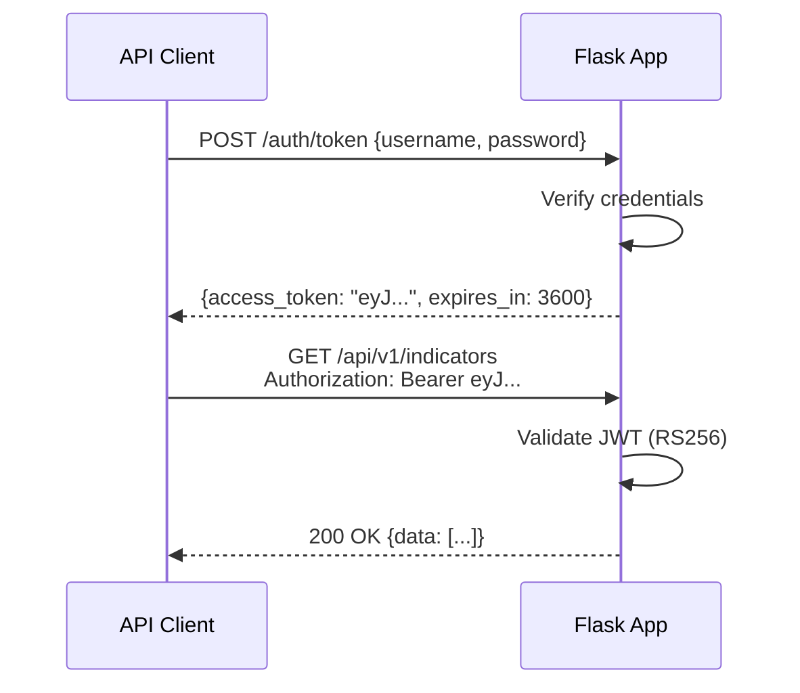

# 11 — Załącznik C: Specyfikacja API

[← Powrót do README](../README.md) | [← Diagramy](./diagrams.md) | [Następna: Schemat Bazy Danych →](./database-schema.md)

---

## OpenAPI 3.0 Specification (fragment)

```yaml
openapi: 3.0.3
info:
  title: IOC Service API
  description: Threat Intelligence Feed Aggregator API
  version: 1.0.0
  contact:
    name: IOC Service Team
  license:
    name: MIT

servers:
  - url: https://ioc-service.example.com/api/v1
    description: Production
  - url: http://localhost:8080/api/v1
    description: Development

security:
  - bearerAuth: []
  - cookieAuth: []

paths:
  /indicators:
    get:
      summary: Search indicators
      description: |
        Wyszukuje IOC z filtrowaniem, paginacją i sortowaniem.
        Wspiera Kibana-like query syntax.
      tags: [Indicators]
      parameters:
        - name: query
          in: query
          schema: { type: string }
          description: "Search query (Kibana syntax: `type:ip AND source:crowdsec`)"
        - name: source
          in: query
          schema: { type: string }
          description: "Filter by source (crowdsec, misp, mwdb, etc.)"
        - name: type
          in: query
          schema:
            type: string
            enum: [ip, domain, url, hash_md5, hash_sha1, hash_sha256, email]
        - name: is_active
          in: query
          schema: { type: boolean, default: true }
        - name: confidence_min
          in: query
          schema: { type: integer, minimum: 0, maximum: 100 }
        - name: tlp
          in: query
          schema:
            type: string
            enum: [WHITE, GREEN, AMBER, RED]
        - name: page
          in: query
          schema: { type: integer, default: 1, minimum: 1 }
        - name: per_page
          in: query
          schema: { type: integer, default: 50, minimum: 1, maximum: 100 }
        - name: sort
          in: query
          schema: { type: string, default: "-last_seen" }
          description: "Sort field. Prefix with - for descending."
      responses:
        '200':
          description: List of indicators
          content:
            application/json:
              schema:
                type: object
                properties:
                  data:
                    type: array
                    items: { $ref: '#/components/schemas/Indicator' }
                  pagination:
                    $ref: '#/components/schemas/Pagination'
        '400': { $ref: '#/components/responses/ValidationError' }
        '401': { $ref: '#/components/responses/Unauthorized' }

  /indicators/export:
    get:
      summary: Export indicators
      description: |
        Eksportuje IOC w wybranym formacie.
        Wspiera 17 formatów (csv, json, xml, fortigate, sentinel, etc.).
      tags: [Export]
      parameters:
        - name: format
          in: query
          required: true
          schema:
            type: string
            enum: [txt, csv, json, xml, fortigate, fortigate_ips,
                   checkpoint, paloalto, sentinel, defender, f5,
                   imperva, arcsight, elasticsearch, cribl, splunk, fidelis]
        - name: query
          in: query
          schema: { type: string }
        - name: limit
          in: query
          schema: { type: integer, default: 10000 }
      responses:
        '200':
          description: Exported data
          content:
            text/csv: {}
            application/json: {}
            application/xml: {}
            text/plain: {}

  /feeds:
    get:
      summary: List configured feeds
      tags: [Feeds]
      security:
        - bearerAuth: []
      responses:
        '200':
          content:
            application/json:
              schema:
                type: object
                properties:
                  data:
                    type: array
                    items: { $ref: '#/components/schemas/Feed' }

  /feeds/{source_id}/sync:
    post:
      summary: Trigger manual feed sync
      tags: [Feeds]
      security:
        - bearerAuth: []
      parameters:
        - name: source_id
          in: path
          required: true
          schema: { type: string }
      responses:
        '202':
          description: Sync job accepted
          content:
            application/json:
              schema:
                type: object
                properties:
                  job_id: { type: string }
                  status: { type: string, enum: [queued] }

  /health:
    get:
      summary: Liveness check
      tags: [System]
      security: []
      responses:
        '200':
          content:
            application/json:
              schema:
                type: object
                properties:
                  status: { type: string, enum: [ok] }
                  version: { type: string }

  /ready:
    get:
      summary: Readiness check
      tags: [System]
      security: []
      responses:
        '200':
          content:
            application/json:
              schema:
                type: object
                properties:
                  status: { type: string, enum: [ready, not_ready] }
                  checks:
                    type: object
                    properties:
                      database: { type: string }
                      redis: { type: string }

components:
  schemas:
    Indicator:
      type: object
      properties:
        id: { type: integer }
        uuid: { type: string, format: uuid }
        value: { type: string, example: "192.168.1.100" }
        type: { type: string, enum: [ip, domain, url, hash_md5, hash_sha256, email] }
        source: { type: string, example: "crowdsec" }
        source_id: { type: string }
        confidence: { type: integer, minimum: 0, maximum: 100 }
        tlp: { type: string, enum: [WHITE, GREEN, AMBER, RED] }
        is_active: { type: boolean }
        tags: { type: array, items: { type: string } }
        metadata: { type: object }
        first_seen: { type: string, format: date-time }
        last_seen: { type: string, format: date-time }
        created_at: { type: string, format: date-time }

    Feed:
      type: object
      properties:
        source_id: { type: string }
        display_name: { type: string }
        enabled: { type: boolean }
        status: { type: string, enum: [ok, error, circuit_open, disabled] }
        last_sync: { type: string, format: date-time }
        total_indicators: { type: integer }
        active_indicators: { type: integer }
        capabilities:
          type: object
          properties:
            supported_ioc_types: { type: array, items: { type: string } }
            requires_auth: { type: boolean }

    Pagination:
      type: object
      properties:
        page: { type: integer }
        per_page: { type: integer }
        total: { type: integer }
        total_pages: { type: integer }
        has_next: { type: boolean }
        has_prev: { type: boolean }

    Error:
      type: object
      properties:
        error:
          type: object
          properties:
            code: { type: string }
            message: { type: string }
            details: { type: array, items: { type: object } }
            request_id: { type: string }
            timestamp: { type: string, format: date-time }

  securitySchemes:
    bearerAuth:
      type: http
      scheme: bearer
      bearerFormat: JWT
    cookieAuth:
      type: apiKey
      in: cookie
      name: session

  responses:
    ValidationError:
      description: Validation error
      content:
        application/json:
          schema: { $ref: '#/components/schemas/Error' }
    Unauthorized:
      description: Authentication required
      content:
        application/json:
          schema: { $ref: '#/components/schemas/Error' }
```

---

## API Endpoints List

| Method | Endpoint | Auth | Role | Description |
|--------|----------|------|------|-------------|
| GET | `/api/v1/indicators` | ✅ | viewer+ | Search indicators |
| GET | `/api/v1/indicators/{id}` | ✅ | viewer+ | Get single indicator |
| GET | `/api/v1/indicators/export` | ✅ | viewer+ | Export indicators |
| GET | `/api/v1/feeds` | ✅ | viewer+ | List feeds |
| GET | `/api/v1/feeds/{id}` | ✅ | viewer+ | Feed details |
| POST | `/api/v1/feeds/{id}/sync` | ✅ | operator+ | Trigger sync |
| PUT | `/api/v1/feeds/{id}` | ✅ | admin | Update feed config |
| POST | `/api/v1/feeds/{id}/test` | ✅ | operator+ | Test connection |
| GET | `/api/v1/health` | ❌ | — | Liveness check |
| GET | `/api/v1/ready` | ❌ | — | Readiness check |
| GET | `/api/v1/metrics` | ❌ | — | Prometheus metrics |
| POST | `/auth/login` | ❌ | — | Login |
| POST | `/auth/logout` | ✅ | any | Logout |
| POST | `/auth/token` | ❌ | — | Get JWT |
| GET | `/admin/*` | ✅ | admin | Admin panel |

---

## Authentication Flow

### Web UI (Session-based)

```mermaid
sequenceDiagram
    participant Browser
    participant App as Flask App
    participant Redis
    
    Browser->>App: POST /auth/login {username, password}
    App->>App: Verify password (argon2)
    App->>Redis: Create session
    App-->>Browser: Set-Cookie: session=xyz; Secure; HttpOnly
    
    Browser->>App: GET /admin (Cookie: session=xyz)
    App->>Redis: Validate session
    Redis-->>App: User data + role
    App-->>Browser: 200 OK (admin page)
```

### API (JWT-based)



---

## Rate Limiting Policy

| Endpoint Group | Limit | Window | Scope |
|----------------|-------|--------|-------|
| `/auth/login` | 5 | 15 min | Per IP |
| `/api/v1/indicators` | 100 | 1 min | Per user |
| `/api/v1/indicators/export` | 10 | 1 min | Per user |
| `/api/v1/feeds/*/sync` | 5 | 5 min | Per user |
| `/api/v1/health` | 60 | 1 min | Per IP |
| All other | 200 | 1 min | Per IP |

Response on rate limit exceeded:
```json
{
    "error": {
        "code": "RATE_LIMIT_EXCEEDED",
        "message": "Too many requests. Retry after 45 seconds.",
        "retry_after": 45
    }
}
```

Headers:
```
X-RateLimit-Limit: 100
X-RateLimit-Remaining: 0
X-RateLimit-Reset: 1712505600
Retry-After: 45
```

---

[← Diagramy](./diagrams.md) | [Następna: Schemat Bazy Danych →](./database-schema.md)
