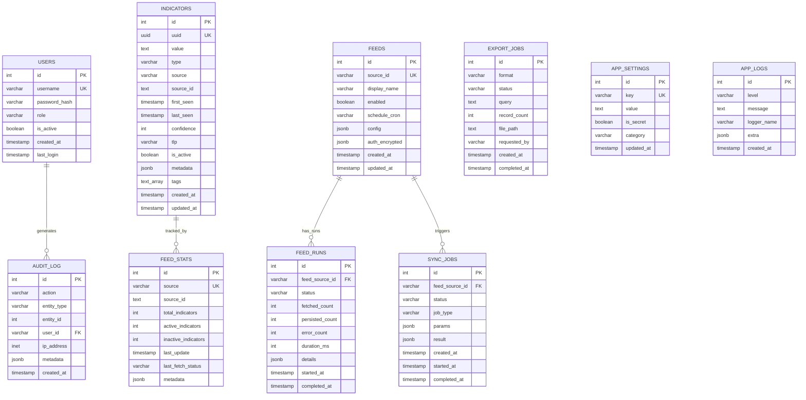

# 11 — Załącznik D: Schemat Bazy Danych

[← Powrót do README](../README.md) | [← Specyfikacja API](./api-specifications.md)

---

## ERD Diagram



---

## Table Definitions

### indicators (główna tabela)

```sql
CREATE TABLE indicators (
    id              SERIAL PRIMARY KEY,
    uuid            UUID NOT NULL DEFAULT gen_random_uuid() UNIQUE,
    value           TEXT NOT NULL,
    type            VARCHAR(20) NOT NULL,
    source          VARCHAR(50) NOT NULL,
    source_id       TEXT,
    first_seen      TIMESTAMP WITH TIME ZONE NOT NULL DEFAULT NOW(),
    last_seen       TIMESTAMP WITH TIME ZONE NOT NULL DEFAULT NOW(),
    confidence      INTEGER NOT NULL DEFAULT 50 CHECK (confidence BETWEEN 0 AND 100),
    tlp             VARCHAR(15) NOT NULL DEFAULT 'GREEN',
    is_active       BOOLEAN NOT NULL DEFAULT TRUE,
    metadata        JSONB NOT NULL DEFAULT '{}',
    tags            TEXT[] NOT NULL DEFAULT '{}',
    created_at      TIMESTAMP WITH TIME ZONE NOT NULL DEFAULT NOW(),
    updated_at      TIMESTAMP WITH TIME ZONE NOT NULL DEFAULT NOW(),
    
    CONSTRAINT unique_indicator UNIQUE (value, source, source_id)
);

-- Indexes
CREATE INDEX idx_indicators_source ON indicators (source);
CREATE INDEX idx_indicators_type ON indicators (type);
CREATE INDEX idx_indicators_active ON indicators (is_active, last_seen) WHERE is_active = TRUE;
CREATE INDEX idx_indicators_value_trgm ON indicators USING gin (value gin_trgm_ops);
CREATE INDEX idx_indicators_metadata ON indicators USING gin (metadata);
CREATE INDEX idx_indicators_tags ON indicators USING gin (tags);
CREATE INDEX idx_indicators_confidence ON indicators (confidence) WHERE is_active = TRUE;
CREATE INDEX idx_indicators_created ON indicators (created_at DESC);
```

### users (nowa tabela — M1.4.2)

```sql
CREATE TABLE users (
    id              SERIAL PRIMARY KEY,
    username        VARCHAR(100) NOT NULL UNIQUE,
    password_hash   VARCHAR(256) NOT NULL,
    role            VARCHAR(20) NOT NULL DEFAULT 'viewer'
                    CHECK (role IN ('admin', 'operator', 'viewer', 'api_service')),
    is_active       BOOLEAN NOT NULL DEFAULT TRUE,
    created_at      TIMESTAMP WITH TIME ZONE NOT NULL DEFAULT NOW(),
    last_login      TIMESTAMP WITH TIME ZONE,
    
    CONSTRAINT username_not_empty CHECK (length(trim(username)) > 0)
);

CREATE INDEX idx_users_username ON users (username);
CREATE INDEX idx_users_active ON users (is_active) WHERE is_active = TRUE;
```

### feeds (rozszerzona — M1.6.1)

```sql
CREATE TABLE feeds (
    id              SERIAL PRIMARY KEY,
    source_id       VARCHAR(50) NOT NULL UNIQUE,
    display_name    VARCHAR(100) NOT NULL,
    enabled         BOOLEAN NOT NULL DEFAULT TRUE,
    schedule_cron   VARCHAR(50) NOT NULL DEFAULT '*/30 * * * *',
    config          JSONB NOT NULL DEFAULT '{}',
    auth_encrypted  JSONB NOT NULL DEFAULT '{}',  -- Encrypted auth data
    created_at      TIMESTAMP WITH TIME ZONE NOT NULL DEFAULT NOW(),
    updated_at      TIMESTAMP WITH TIME ZONE NOT NULL DEFAULT NOW()
);
```

---

## Index Strategy

| Indeks | Typ | Tabela | Use Case | Szacowany rozmiar |
|--------|-----|--------|----------|-------------------|
| `unique_indicator` | UNIQUE B-tree | indicators | Upsert dedup | ~20MB per 200k rows |
| `idx_value_trgm` | GIN trigram | indicators | Substring search | ~40MB per 200k rows |
| `idx_metadata` | GIN | indicators | JSONB queries | ~30MB per 200k rows |
| `idx_tags` | GIN | indicators | Array contains | ~15MB per 200k rows |
| `idx_active` | B-tree partial | indicators | Active only queries | ~5MB (partial) |
| `idx_source` | B-tree | indicators | Source filter | ~10MB per 200k rows |

### Zasady indeksowania

1. **Partial indexes** dla frequently filtered columns (`is_active = TRUE`)
2. **GIN indexes** dla JSONB i array columns
3. **Trigram index** dla substring/fuzzy search
4. **Composite indexes** nie są potrzebne (PostgreSQL bitmap scan wystarczy)
5. **CONCURRENTLY** przy tworzeniu indexów na produkcji

---

## Migration Strategy

### Obecny stan

```
database/init/*.sql  ← 9 plików SQL (legacy, dual source)
app/models.py        ← SQLAlchemy ORM (drugi source of truth)
alembic/versions/    ← Alembic migrations (third source?)
```

### Docelowy stan (po M1.5.1)

```
alembic/versions/    ← JEDYNE źródło prawdy
app/models.py        ← Generowane/synchronizowane z Alembic
database/init/*.sql  ← USUNIĘTE (deprecated)
```

### Migration Commands

```bash
# Tworzenie nowej migracji (autogenerate z modeli)
alembic revision --autogenerate -m "add_users_table"

# Upgrade do najnowszej wersji
alembic upgrade head

# Rollback o 1 krok
alembic downgrade -1

# Sprawdzenie obecnej wersji
alembic current

# Historia migracji
alembic history --verbose

# Schema drift detection
alembic check  # Returns non-zero if models differ from DB
```

---

## Backup & Recovery

### Backup

```bash
# Full backup (pg_dump)
pg_dump -U ioc -Fc ioc_service > backup_$(date +%Y%m%d).dump

# WAL archiving (continuous)
archive_mode = on
archive_command = 'cp %p /backups/wal/%f'

# Point-in-time recovery target
recovery_target_time = '2026-04-07 12:00:00+02'
```

### Recovery

```bash
# Restore from dump
pg_restore -U ioc -d ioc_service backup_20260407.dump

# PITR (Point-in-Time Recovery)
restore_command = 'cp /backups/wal/%f %p'
recovery_target_time = '2026-04-07 12:00:00+02'
```

### Recovery Tests

| Test | Częstotliwość | Kryteria sukcesu |
|------|---------------|------------------|
| Full restore | Miesięcznie | Schema match + data integrity |
| PITR test | Kwartalnie | Restore to specific point |
| Alembic upgrade/downgrade | Każdy PR | Clean up/down cycle |

---

[← Specyfikacja API](./api-specifications.md) | [Powrót do README →](../README.md)
