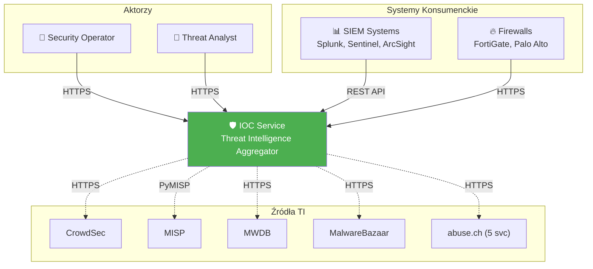
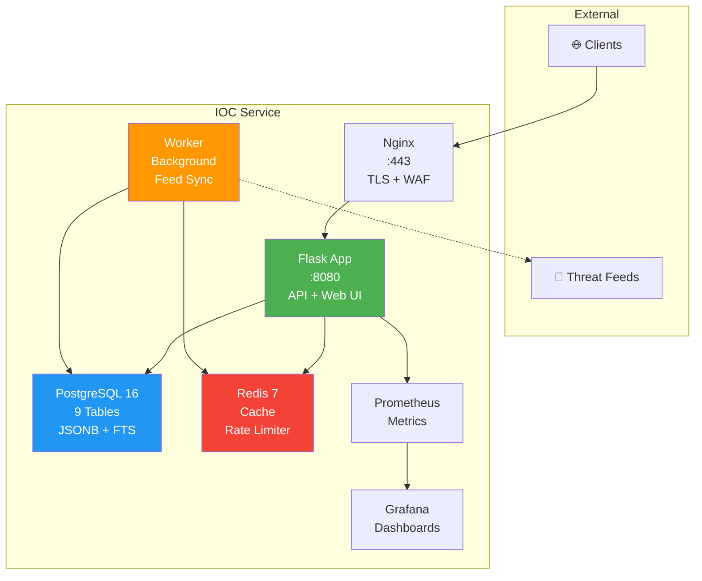
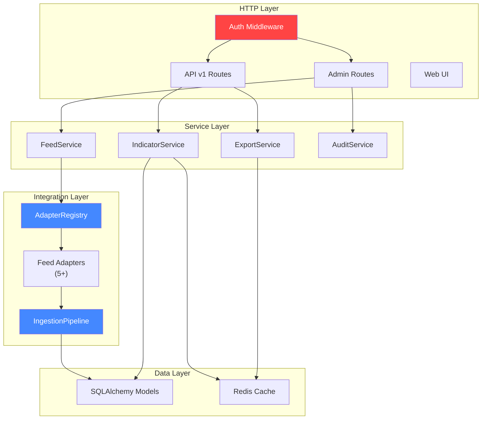
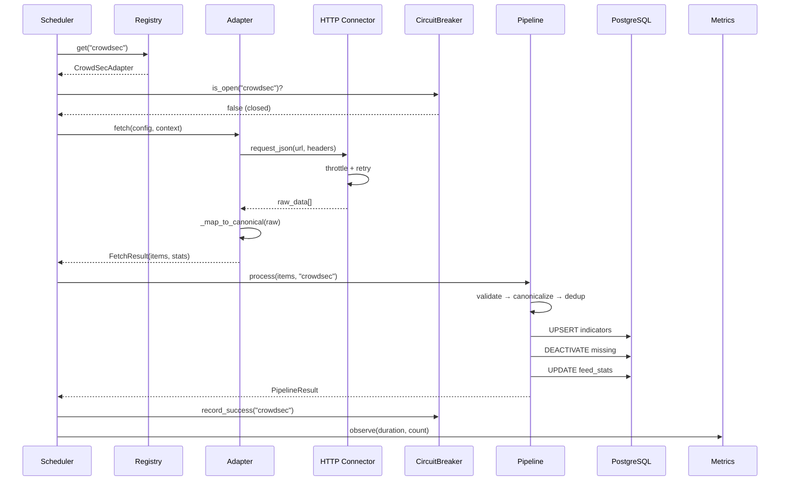
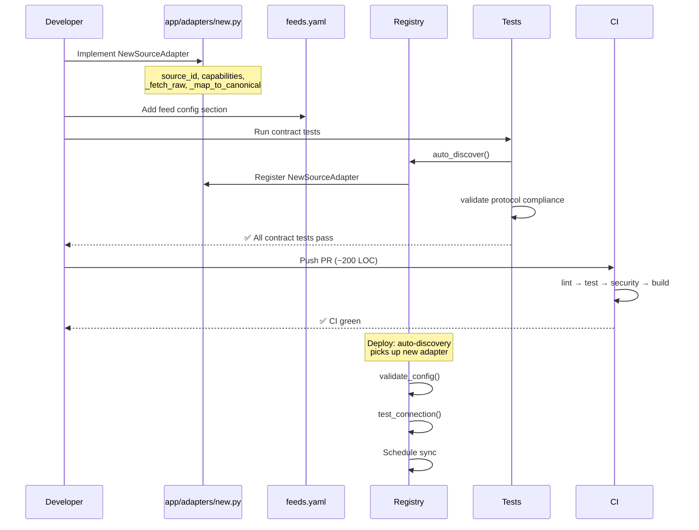
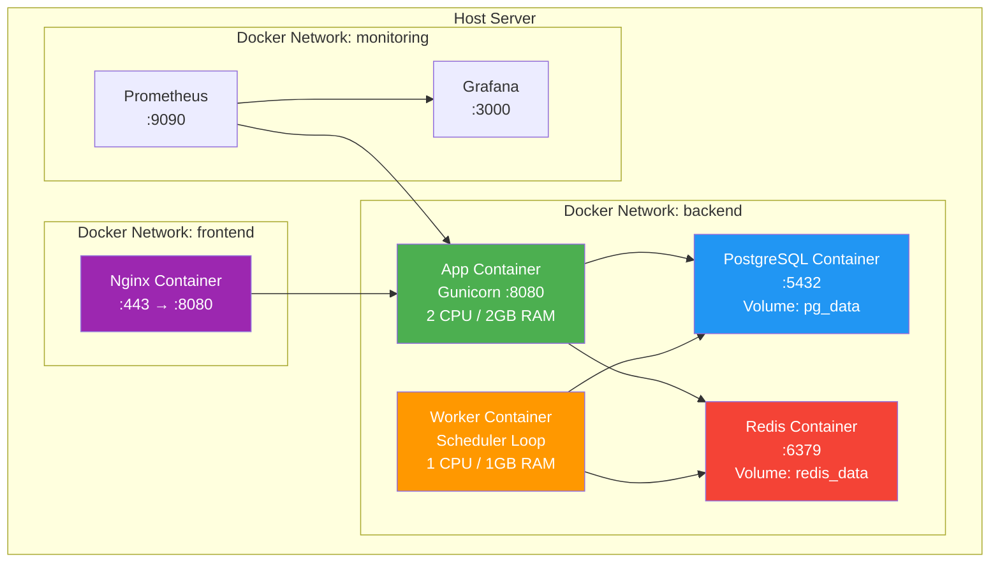
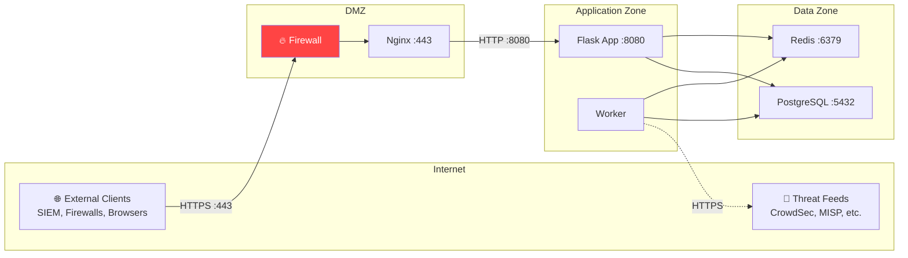

# 11 — Załącznik B: Diagramy

[← Powrót do README](../README.md) | [← Słownik](./glossary.md) | [Następna: Specyfikacja API →](./api-specifications.md)

---

## C4 Context Diagram (Poziom 1)

---

## C4 Container Diagram (Poziom 2)

---

## C4 Component Diagram — Application (Poziom 3)

---

## Sequence Diagram — Feed Ingestion

---

## Sequence Diagram — Dodawanie Nowego Adaptera

---

## Deployment Diagram

---

## Network Diagram

---

[← Słownik](./glossary.md) | [Następna: Specyfikacja API →](./api-specifications.md)
